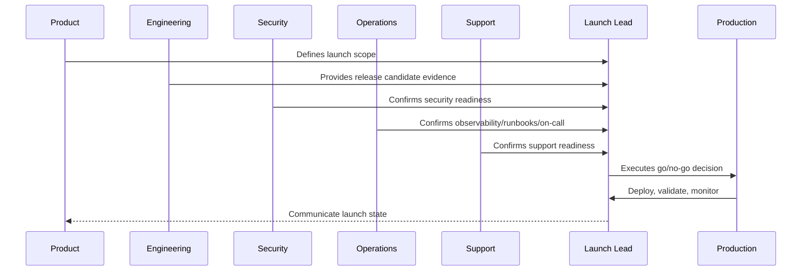

# Security and Compliance Launch Readiness

> *"Defines launch readiness checks for authentication, authorization, data protection, secrets, vulnerability posture, logging, audit, privacy, and compliance evidence."*

---

# Purpose

Defines launch readiness checks for authentication, authorization, data protection, secrets, vulnerability posture, logging, audit, privacy, and compliance evidence.

---

# Launch Problem

Security shortcuts during launch can create incidents, data leaks, and audit failures.

---

# Launch Decision

## Decision

CLARA security and compliance readiness should be verified before production exposure and tracked as launch evidence.

## Status

Accepted.

---

# Production Launch Rule

Every CLARA production launch should move through:

```text
Scope Definition -> Release Candidate -> Readiness Review -> Go/No-Go -> Deployment -> Smoke Validation -> Monitoring Window -> Stabilization Review -> Post-Launch Follow-Up
```

A launch is not production-ready if it cannot answer:

```text
what is being launched
who owns launch execution
what is intentionally excluded
what risks are known
what readiness evidence exists
what customer impact is expected
what monitoring will be watched
what rollback triggers exist
who communicates status
who handles support escalation
what happens after launch
```

---

# Recommended Launch Flow



---

# Production-Ready Checklist

- [ ] Launch scope is documented.
- [ ] Release candidate is identified.
- [ ] Go/no-go criteria are defined.
- [ ] Security readiness is checked.
- [ ] Operations readiness is checked.
- [ ] Support readiness is checked.
- [ ] Data/migration readiness is checked.
- [ ] Integration readiness is checked.
- [ ] AI/automation readiness is checked.
- [ ] Smoke tests are defined.
- [ ] Rollback triggers are defined.
- [ ] Launch communication owner is assigned.
- [ ] Post-launch monitoring window is scheduled.

---

# Acceptance Criteria

- [ ] Launch plan is actionable.
- [ ] Owners are assigned.
- [ ] Readiness evidence is captured.
- [ ] Risks are visible.
- [ ] Rollback/mitigation is understood.
- [ ] Monitoring and support are ready.
- [ ] AI coding assistants can apply this safely.

---

# Anti-patterns

Avoid:

- Launching with unclear scope.
- Adding features during launch freeze.
- No go/no-go decision owner.
- No rollback criteria.
- No support playbook.
- No on-call coverage.
- No migration validation.
- No integration production verification.
- No AI kill switch.
- No launch monitoring dashboard.
- Relying on chat messages as launch evidence.

---

# Related Documents

- ../PART-09-CI-CD-and-Environment-Implementation/README.md
- ../PART-08-Testing-and-Quality-Implementation/README.md
- ../../BOOK-06-Security-Governance-and-Compliance/BOOK-06-Master-Index/README.md
- ../../BOOK-07-Operations-Observability-and-Reliability/BOOK-07-Master-Index/README.md
- ../../BOOK-07-Operations-Observability-and-Reliability/PART-09-Runbooks-and-Playbooks/README.md

---

# Navigation

**Previous:** `112-Pre-Launch-Checklist.md`

**Next:** `114-Operations-and-Support-Launch-Readiness.md`

---

# Security Launch Checks

Verify:

```text
authentication flows
authorization/IDOR tests
tenant/workspace isolation
secrets not committed
production debug disabled
TLS/secure headers where applicable
dependency scan results
webhook signature verification
AI prompt injection tests where applicable
audit logging for sensitive actions
rate limiting on abuse-prone endpoints
```

---

# Compliance Evidence

Capture:

```text
access review evidence
security scan reports
risk acceptance records
privacy/data handling review
audit event readiness
retention/deletion behavior status
incident response contact path
```

---

# Security Go/No-Go Examples

No-go if:

```text
known critical authz bypass
production secret leaked
webhook verification disabled
tenant isolation test failing
critical vulnerability unmitigated
audit for sensitive launch feature missing
```

---

# Security Rule

Launch pressure is not an acceptable reason to bypass security controls.
