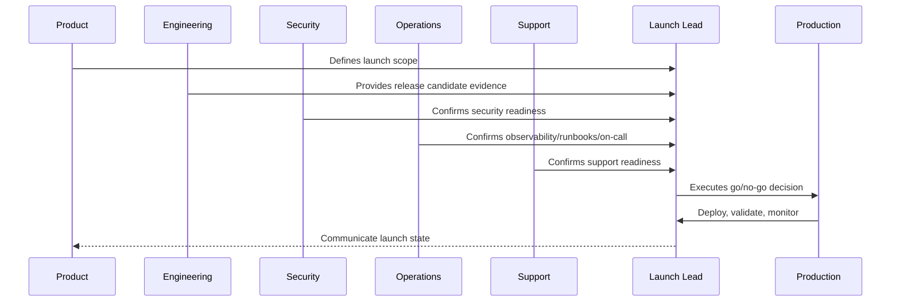
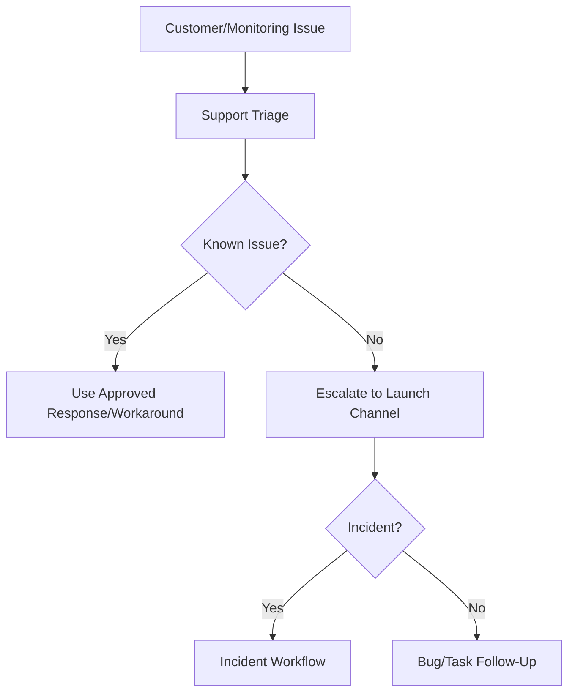

# Operations and Support Launch Readiness

> *"Defines launch readiness checks for on-call, runbooks, alerts, dashboards, support playbooks, known issues, escalation, and incident coordination."*

---

# Purpose

Defines launch readiness checks for on-call, runbooks, alerts, dashboards, support playbooks, known issues, escalation, and incident coordination.

---

# Launch Problem

A technically successful deploy can still be a failed launch if support and operations are unprepared.

---

# Launch Decision

## Decision

CLARA operations and support teams should be ready to detect, triage, communicate, and resolve launch issues before users are exposed.

## Status

Accepted.

---

# Production Launch Rule

Every CLARA production launch should move through:

```text
Scope Definition -> Release Candidate -> Readiness Review -> Go/No-Go -> Deployment -> Smoke Validation -> Monitoring Window -> Stabilization Review -> Post-Launch Follow-Up
```

A launch is not production-ready if it cannot answer:

```text
what is being launched
who owns launch execution
what is intentionally excluded
what risks are known
what readiness evidence exists
what customer impact is expected
what monitoring will be watched
what rollback triggers exist
who communicates status
who handles support escalation
what happens after launch
```

---

# Recommended Launch Flow



---

# Production-Ready Checklist

- [ ] Launch scope is documented.
- [ ] Release candidate is identified.
- [ ] Go/no-go criteria are defined.
- [ ] Security readiness is checked.
- [ ] Operations readiness is checked.
- [ ] Support readiness is checked.
- [ ] Data/migration readiness is checked.
- [ ] Integration readiness is checked.
- [ ] AI/automation readiness is checked.
- [ ] Smoke tests are defined.
- [ ] Rollback triggers are defined.
- [ ] Launch communication owner is assigned.
- [ ] Post-launch monitoring window is scheduled.

---

# Acceptance Criteria

- [ ] Launch plan is actionable.
- [ ] Owners are assigned.
- [ ] Readiness evidence is captured.
- [ ] Risks are visible.
- [ ] Rollback/mitigation is understood.
- [ ] Monitoring and support are ready.
- [ ] AI coding assistants can apply this safely.

---

# Anti-patterns

Avoid:

- Launching with unclear scope.
- Adding features during launch freeze.
- No go/no-go decision owner.
- No rollback criteria.
- No support playbook.
- No on-call coverage.
- No migration validation.
- No integration production verification.
- No AI kill switch.
- No launch monitoring dashboard.
- Relying on chat messages as launch evidence.

---

# Related Documents

- ../PART-09-CI-CD-and-Environment-Implementation/README.md
- ../PART-08-Testing-and-Quality-Implementation/README.md
- ../../BOOK-06-Security-Governance-and-Compliance/BOOK-06-Master-Index/README.md
- ../../BOOK-07-Operations-Observability-and-Reliability/BOOK-07-Master-Index/README.md
- ../../BOOK-07-Operations-Observability-and-Reliability/PART-09-Runbooks-and-Playbooks/README.md

---

# Navigation

**Previous:** `113-Security-and-Compliance-Launch-Readiness.md`

**Next:** `115-Data-and-Migration-Launch-Readiness.md`

---

# Operations Readiness

Verify:

```text
on-call schedule
escalation path
dashboards
alerts
runbooks
incident channel
status update process
SLO/error budget view where applicable
rollback runbook
known issue process
```

---

# Support Readiness

Verify:

```text
support playbook
FAQ/macros
known limitations
customer impact triage
escalation contacts
permission/support tooling access
safe troubleshooting steps
communication templates
```

---

# Launch Support Flow



---

# Ops Rule

If nobody is watching production after launch, the launch is not operationally ready.
