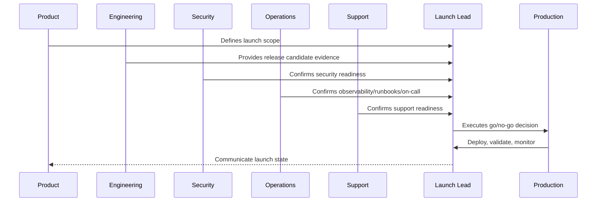

# Data and Migration Launch Readiness

> *"Defines launch readiness for production data, migrations, backups, restore validation, seed/demo data, import/export, retention, and data integrity checks."*

---

# Purpose

Defines launch readiness for production data, migrations, backups, restore validation, seed/demo data, import/export, retention, and data integrity checks.

---

# Launch Problem

Data launch failures are painful because they can corrupt durable state and require complex recovery.

---

# Launch Decision

## Decision

CLARA data launch readiness should confirm that migrations are safe, data integrity is validated, backups exist, and restore path is known.

## Status

Accepted.

---

# Production Launch Rule

Every CLARA production launch should move through:

```text
Scope Definition -> Release Candidate -> Readiness Review -> Go/No-Go -> Deployment -> Smoke Validation -> Monitoring Window -> Stabilization Review -> Post-Launch Follow-Up
```

A launch is not production-ready if it cannot answer:

```text
what is being launched
who owns launch execution
what is intentionally excluded
what risks are known
what readiness evidence exists
what customer impact is expected
what monitoring will be watched
what rollback triggers exist
who communicates status
who handles support escalation
what happens after launch
```

---

# Recommended Launch Flow



---

# Production-Ready Checklist

- [ ] Launch scope is documented.
- [ ] Release candidate is identified.
- [ ] Go/no-go criteria are defined.
- [ ] Security readiness is checked.
- [ ] Operations readiness is checked.
- [ ] Support readiness is checked.
- [ ] Data/migration readiness is checked.
- [ ] Integration readiness is checked.
- [ ] AI/automation readiness is checked.
- [ ] Smoke tests are defined.
- [ ] Rollback triggers are defined.
- [ ] Launch communication owner is assigned.
- [ ] Post-launch monitoring window is scheduled.

---

# Acceptance Criteria

- [ ] Launch plan is actionable.
- [ ] Owners are assigned.
- [ ] Readiness evidence is captured.
- [ ] Risks are visible.
- [ ] Rollback/mitigation is understood.
- [ ] Monitoring and support are ready.
- [ ] AI coding assistants can apply this safely.

---

# Anti-patterns

Avoid:

- Launching with unclear scope.
- Adding features during launch freeze.
- No go/no-go decision owner.
- No rollback criteria.
- No support playbook.
- No on-call coverage.
- No migration validation.
- No integration production verification.
- No AI kill switch.
- No launch monitoring dashboard.
- Relying on chat messages as launch evidence.

---

# Related Documents

- ../PART-09-CI-CD-and-Environment-Implementation/README.md
- ../PART-08-Testing-and-Quality-Implementation/README.md
- ../../BOOK-06-Security-Governance-and-Compliance/BOOK-06-Master-Index/README.md
- ../../BOOK-07-Operations-Observability-and-Reliability/BOOK-07-Master-Index/README.md
- ../../BOOK-07-Operations-Observability-and-Reliability/PART-09-Runbooks-and-Playbooks/README.md

---

# Navigation

**Previous:** `114-Operations-and-Support-Launch-Readiness.md`

**Next:** `116-Integration-Launch-Readiness.md`

---

# Data Launch Checks

Verify:

```text
production database access roles
migration plan
migration tested on realistic data
backup completed
restore procedure known
data integrity checks prepared
seed/demo data separated
import/export path reviewed
retention/deletion jobs reviewed
audit data behavior reviewed
```

---

# Migration Launch Evidence

Capture:

```text
migration version
execution plan
rollback/forward-fix plan
expected duration
locking risk
backfill plan
validation queries
owner approval
```

---

# Data Integrity Smoke Checks

After launch, validate:

```text
user/workspace records
membership/role records
conversation/ticket records
integration state
audit events
recent migration version
critical foreign key consistency
```

---

# Data Rule

Do not run irreversible data changes during launch without explicit approval, tested plan, and recovery strategy.
