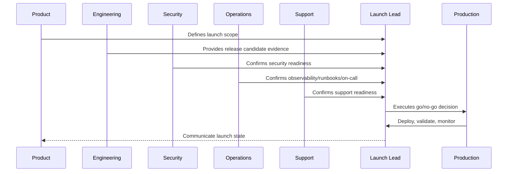

# Integration Launch Readiness

> *"Defines launch readiness for provider credentials, webhook endpoints, signature verification, sandbox-to-production switch, rate limits, retries, DLQs, and integration dashboards."*

---

# Purpose

Defines launch readiness for provider credentials, webhook endpoints, signature verification, sandbox-to-production switch, rate limits, retries, DLQs, and integration dashboards.

---

# Launch Problem

Integrations often fail at launch because production provider behavior differs from mocks and sandboxes.

---

# Launch Decision

## Decision

CLARA integrations should launch only when provider configuration, webhook security, idempotency, observability, and support escalation are ready.

## Status

Accepted.

---

# Production Launch Rule

Every CLARA production launch should move through:

```text
Scope Definition -> Release Candidate -> Readiness Review -> Go/No-Go -> Deployment -> Smoke Validation -> Monitoring Window -> Stabilization Review -> Post-Launch Follow-Up
```

A launch is not production-ready if it cannot answer:

```text
what is being launched
who owns launch execution
what is intentionally excluded
what risks are known
what readiness evidence exists
what customer impact is expected
what monitoring will be watched
what rollback triggers exist
who communicates status
who handles support escalation
what happens after launch
```

---

# Recommended Launch Flow



---

# Production-Ready Checklist

- [ ] Launch scope is documented.
- [ ] Release candidate is identified.
- [ ] Go/no-go criteria are defined.
- [ ] Security readiness is checked.
- [ ] Operations readiness is checked.
- [ ] Support readiness is checked.
- [ ] Data/migration readiness is checked.
- [ ] Integration readiness is checked.
- [ ] AI/automation readiness is checked.
- [ ] Smoke tests are defined.
- [ ] Rollback triggers are defined.
- [ ] Launch communication owner is assigned.
- [ ] Post-launch monitoring window is scheduled.

---

# Acceptance Criteria

- [ ] Launch plan is actionable.
- [ ] Owners are assigned.
- [ ] Readiness evidence is captured.
- [ ] Risks are visible.
- [ ] Rollback/mitigation is understood.
- [ ] Monitoring and support are ready.
- [ ] AI coding assistants can apply this safely.

---

# Anti-patterns

Avoid:

- Launching with unclear scope.
- Adding features during launch freeze.
- No go/no-go decision owner.
- No rollback criteria.
- No support playbook.
- No on-call coverage.
- No migration validation.
- No integration production verification.
- No AI kill switch.
- No launch monitoring dashboard.
- Relying on chat messages as launch evidence.

---

# Related Documents

- ../PART-09-CI-CD-and-Environment-Implementation/README.md
- ../PART-08-Testing-and-Quality-Implementation/README.md
- ../../BOOK-06-Security-Governance-and-Compliance/BOOK-06-Master-Index/README.md
- ../../BOOK-07-Operations-Observability-and-Reliability/BOOK-07-Master-Index/README.md
- ../../BOOK-07-Operations-Observability-and-Reliability/PART-09-Runbooks-and-Playbooks/README.md

---

# Navigation

**Previous:** `115-Data-and-Migration-Launch-Readiness.md`

**Next:** `117-AI-and-Automation-Launch-Readiness.md`

---

# Integration Launch Checks

Verify:

```text
production provider credentials
credential scopes
webhook URLs
signature verification
timestamp/replay protection
idempotency keys
dead-letter queue
rate limit strategy
retry policy
provider status dashboard
sandbox-to-production differences
support escalation path
```

---

# Provider Cutover Checklist

```text
sandbox config disabled where needed
production config enabled
webhook endpoint registered
secret stored in secret manager
test event received
signature verified
normalized event created
processing job succeeded
dashboard updated
```

---

# Integration Smoke Tests

Test:

```text
webhook receive
message/event normalization
duplicate event handling
provider API call
rate-limit-safe behavior
dead-letter visibility
support evidence lookup
```

---

# Integration Rule

Do not enable production webhooks without signature verification and idempotency.
