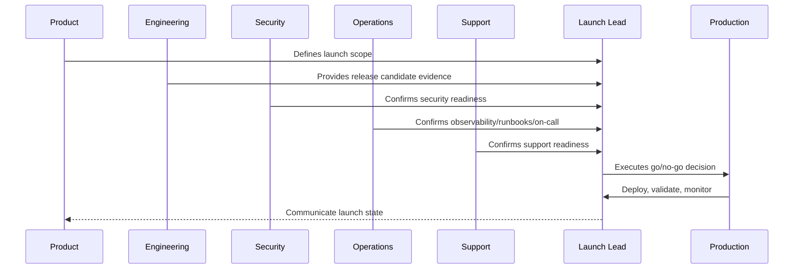

# AI and Automation Launch Readiness

> *"Defines launch readiness for AI Gateway, prompts, RAG, guardrails, human review, automation rules, cost limits, fallback, and kill switches."*

---

# Purpose

Defines launch readiness for AI Gateway, prompts, RAG, guardrails, human review, automation rules, cost limits, fallback, and kill switches.

---

# Launch Problem

AI and automation can create customer-facing harm quickly if launched without strong review and kill-switch controls.

---

# Launch Decision

## Decision

CLARA AI and automation features should launch with guardrails, review workflows, cost controls, quality evidence, and emergency disablement.

## Status

Accepted.

---

# Production Launch Rule

Every CLARA production launch should move through:

```text
Scope Definition -> Release Candidate -> Readiness Review -> Go/No-Go -> Deployment -> Smoke Validation -> Monitoring Window -> Stabilization Review -> Post-Launch Follow-Up
```

A launch is not production-ready if it cannot answer:

```text
what is being launched
who owns launch execution
what is intentionally excluded
what risks are known
what readiness evidence exists
what customer impact is expected
what monitoring will be watched
what rollback triggers exist
who communicates status
who handles support escalation
what happens after launch
```

---

# Recommended Launch Flow



---

# Production-Ready Checklist

- [ ] Launch scope is documented.
- [ ] Release candidate is identified.
- [ ] Go/no-go criteria are defined.
- [ ] Security readiness is checked.
- [ ] Operations readiness is checked.
- [ ] Support readiness is checked.
- [ ] Data/migration readiness is checked.
- [ ] Integration readiness is checked.
- [ ] AI/automation readiness is checked.
- [ ] Smoke tests are defined.
- [ ] Rollback triggers are defined.
- [ ] Launch communication owner is assigned.
- [ ] Post-launch monitoring window is scheduled.

---

# Acceptance Criteria

- [ ] Launch plan is actionable.
- [ ] Owners are assigned.
- [ ] Readiness evidence is captured.
- [ ] Risks are visible.
- [ ] Rollback/mitigation is understood.
- [ ] Monitoring and support are ready.
- [ ] AI coding assistants can apply this safely.

---

# Anti-patterns

Avoid:

- Launching with unclear scope.
- Adding features during launch freeze.
- No go/no-go decision owner.
- No rollback criteria.
- No support playbook.
- No on-call coverage.
- No migration validation.
- No integration production verification.
- No AI kill switch.
- No launch monitoring dashboard.
- Relying on chat messages as launch evidence.

---

# Related Documents

- ../PART-09-CI-CD-and-Environment-Implementation/README.md
- ../PART-08-Testing-and-Quality-Implementation/README.md
- ../../BOOK-06-Security-Governance-and-Compliance/BOOK-06-Master-Index/README.md
- ../../BOOK-07-Operations-Observability-and-Reliability/BOOK-07-Master-Index/README.md
- ../../BOOK-07-Operations-Observability-and-Reliability/PART-09-Runbooks-and-Playbooks/README.md

---

# Navigation

**Previous:** `116-Integration-Launch-Readiness.md`

**Next:** `118-Launch-Day-Execution-Plan.md`

---

# AI Launch Checks

Verify:

```text
AI Gateway enabled path
provider/model config
prompt versions
RAG permission checks
guardrails
human review workflow
cost/token limits
AI telemetry dashboard
fallback behavior
kill switch
prompt injection tests
sensitive data leakage tests
```

---

# Automation Launch Checks

Verify:

```text
automation rules documented
trigger conditions reviewed
approval requirement defined
idempotency implemented
audit events emitted
rollback/compensation path known
kill switch works
owner assigned
runbook exists
```

---

# AI Go/No-Go Examples

No-go if:

```text
AI can send customer-facing message without required review
RAG can retrieve wrong workspace context
kill switch not working
cost limit missing
guardrail tests failing
prompt injection test failing for launch-critical flow
```

---

# AI Rule

Launch AI features as suggestions first unless policy, evidence, and risk profile justify automation.
