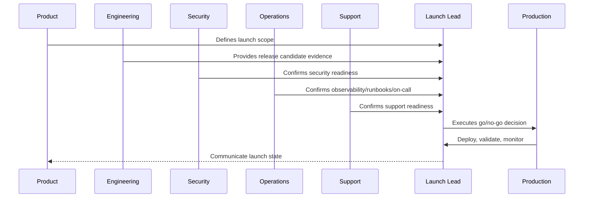

# Launch Day Execution Plan

> *"Defines launch day timeline, roles, communication channels, deployment steps, smoke tests, monitoring windows, go/no-go checkpoints, and rollback triggers."*

---

# Purpose

Defines launch day timeline, roles, communication channels, deployment steps, smoke tests, monitoring windows, go/no-go checkpoints, and rollback triggers.

---

# Launch Problem

Launch chaos happens when teams improvise under time pressure.

---

# Launch Decision

## Decision

CLARA launch day should follow a written execution plan with assigned owners, timestamps, validation steps, and rollback criteria.

## Status

Accepted.

---

# Production Launch Rule

Every CLARA production launch should move through:

```text
Scope Definition -> Release Candidate -> Readiness Review -> Go/No-Go -> Deployment -> Smoke Validation -> Monitoring Window -> Stabilization Review -> Post-Launch Follow-Up
```

A launch is not production-ready if it cannot answer:

```text
what is being launched
who owns launch execution
what is intentionally excluded
what risks are known
what readiness evidence exists
what customer impact is expected
what monitoring will be watched
what rollback triggers exist
who communicates status
who handles support escalation
what happens after launch
```

---

# Recommended Launch Flow



---

# Production-Ready Checklist

- [ ] Launch scope is documented.
- [ ] Release candidate is identified.
- [ ] Go/no-go criteria are defined.
- [ ] Security readiness is checked.
- [ ] Operations readiness is checked.
- [ ] Support readiness is checked.
- [ ] Data/migration readiness is checked.
- [ ] Integration readiness is checked.
- [ ] AI/automation readiness is checked.
- [ ] Smoke tests are defined.
- [ ] Rollback triggers are defined.
- [ ] Launch communication owner is assigned.
- [ ] Post-launch monitoring window is scheduled.

---

# Acceptance Criteria

- [ ] Launch plan is actionable.
- [ ] Owners are assigned.
- [ ] Readiness evidence is captured.
- [ ] Risks are visible.
- [ ] Rollback/mitigation is understood.
- [ ] Monitoring and support are ready.
- [ ] AI coding assistants can apply this safely.

---

# Anti-patterns

Avoid:

- Launching with unclear scope.
- Adding features during launch freeze.
- No go/no-go decision owner.
- No rollback criteria.
- No support playbook.
- No on-call coverage.
- No migration validation.
- No integration production verification.
- No AI kill switch.
- No launch monitoring dashboard.
- Relying on chat messages as launch evidence.

---

# Related Documents

- ../PART-09-CI-CD-and-Environment-Implementation/README.md
- ../PART-08-Testing-and-Quality-Implementation/README.md
- ../../BOOK-06-Security-Governance-and-Compliance/BOOK-06-Master-Index/README.md
- ../../BOOK-07-Operations-Observability-and-Reliability/BOOK-07-Master-Index/README.md
- ../../BOOK-07-Operations-Observability-and-Reliability/PART-09-Runbooks-and-Playbooks/README.md

---

# Navigation

**Previous:** `117-AI-and-Automation-Launch-Readiness.md`

**Next:** `119-Launch-Communication-and-Post-Launch-Monitoring.md`

---

# Launch Day Timeline Template

```text
T-60m launch team assembled
T-45m final readiness check
T-30m freeze confirmation
T-15m go/no-go decision
T+0 deploy/promote release
T+10m smoke tests
T+20m dashboard review
T+30m support check
T+60m stabilization checkpoint
T+24h post-launch review
```

---

# Launch Channels

Define:

```text
launch command channel
incident channel
support escalation channel
executive/stakeholder update path
customer communication path
```

---

# Rollback Triggers

Examples:

```text
critical auth failure
core workflow unavailable
data corruption signal
migration failure
error rate exceeds threshold
queue lag exceeds threshold
AI/automation unsafe behavior
integration event loss
support volume spike with confirmed product issue
```

---

# Launch Day Rule

Only the launch lead or designated incident commander should make go/no-go and rollback calls.
