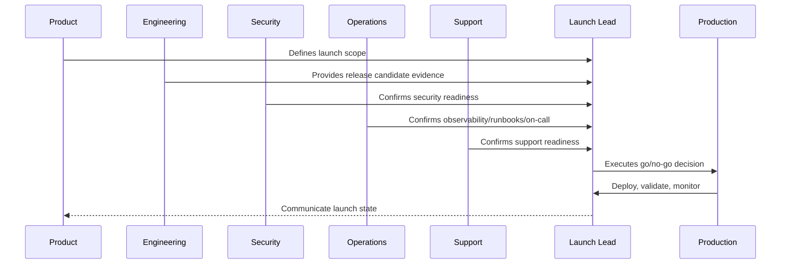
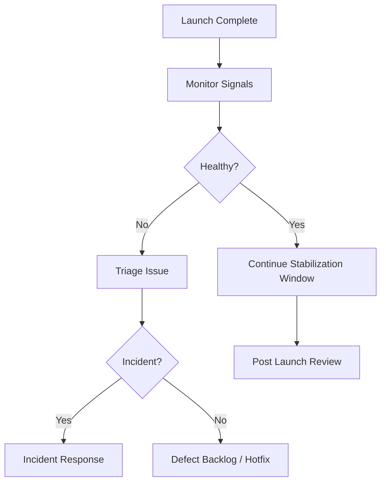

# Launch Communication and Post-Launch Monitoring

> *"Defines internal/external launch communication, customer support readiness, status updates, post-launch monitoring, launch metrics, defect triage, and stabilization window."*

---

# Purpose

Defines internal/external launch communication, customer support readiness, status updates, post-launch monitoring, launch metrics, defect triage, and stabilization window.

---

# Launch Problem

Poor communication turns manageable issues into trust problems.

---

# Launch Decision

## Decision

CLARA launch communication and monitoring should keep stakeholders aligned and detect customer-impacting issues quickly after release.

## Status

Accepted.

---

# Production Launch Rule

Every CLARA production launch should move through:

```text
Scope Definition -> Release Candidate -> Readiness Review -> Go/No-Go -> Deployment -> Smoke Validation -> Monitoring Window -> Stabilization Review -> Post-Launch Follow-Up
```

A launch is not production-ready if it cannot answer:

```text
what is being launched
who owns launch execution
what is intentionally excluded
what risks are known
what readiness evidence exists
what customer impact is expected
what monitoring will be watched
what rollback triggers exist
who communicates status
who handles support escalation
what happens after launch
```

---

# Recommended Launch Flow



---

# Production-Ready Checklist

- [ ] Launch scope is documented.
- [ ] Release candidate is identified.
- [ ] Go/no-go criteria are defined.
- [ ] Security readiness is checked.
- [ ] Operations readiness is checked.
- [ ] Support readiness is checked.
- [ ] Data/migration readiness is checked.
- [ ] Integration readiness is checked.
- [ ] AI/automation readiness is checked.
- [ ] Smoke tests are defined.
- [ ] Rollback triggers are defined.
- [ ] Launch communication owner is assigned.
- [ ] Post-launch monitoring window is scheduled.

---

# Acceptance Criteria

- [ ] Launch plan is actionable.
- [ ] Owners are assigned.
- [ ] Readiness evidence is captured.
- [ ] Risks are visible.
- [ ] Rollback/mitigation is understood.
- [ ] Monitoring and support are ready.
- [ ] AI coding assistants can apply this safely.

---

# Anti-patterns

Avoid:

- Launching with unclear scope.
- Adding features during launch freeze.
- No go/no-go decision owner.
- No rollback criteria.
- No support playbook.
- No on-call coverage.
- No migration validation.
- No integration production verification.
- No AI kill switch.
- No launch monitoring dashboard.
- Relying on chat messages as launch evidence.

---

# Related Documents

- ../PART-09-CI-CD-and-Environment-Implementation/README.md
- ../PART-08-Testing-and-Quality-Implementation/README.md
- ../../BOOK-06-Security-Governance-and-Compliance/BOOK-06-Master-Index/README.md
- ../../BOOK-07-Operations-Observability-and-Reliability/BOOK-07-Master-Index/README.md
- ../../BOOK-07-Operations-Observability-and-Reliability/PART-09-Runbooks-and-Playbooks/README.md

---

# Navigation

**Previous:** `118-Launch-Day-Execution-Plan.md`

**Next:** `120-Part-10-Summary.md`

---

# Communication Plan

Define:

```text
internal launch announcement
stakeholder status updates
support team briefing
customer-facing release notes where applicable
incident/status page process
post-launch summary
```

---

# Post-Launch Monitoring Window

Watch for:

```text
error rate
latency
frontend errors
auth failures
database slow queries
queue lag
webhook failures
AI error/cost/safety blocks
support ticket volume
SLO burn rate
```

---

# Stabilization Workflow



---

# Communication Rule

Communicate facts, status, impact, and next update time. Do not speculate.
