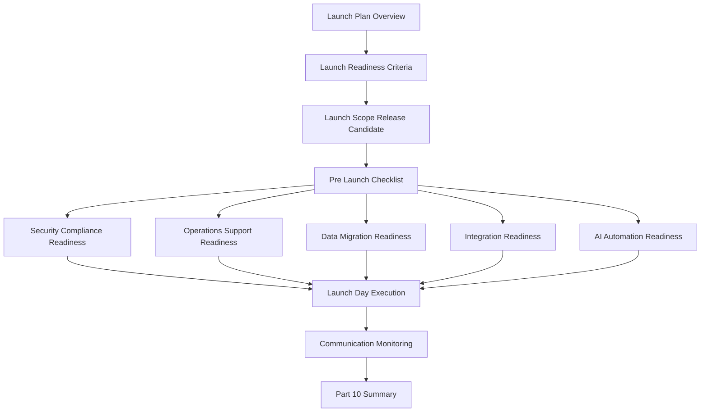

# PART-10 — Production Launch Plan

> *"Launch is not the moment software goes live. Launch is the moment product, engineering, security, operations, and support accept production responsibility together."*

---

# Purpose

Part 10 defines CLARA's production launch planning standards.

It covers:

- Production Launch Plan overview.
- Launch Readiness Criteria.
- Launch Scope and Release Candidate.
- Pre-Launch Checklist.
- Security and Compliance Launch Readiness.
- Operations and Support Launch Readiness.
- Data and Migration Launch Readiness.
- Integration Launch Readiness.
- AI and Automation Launch Readiness.
- Launch Day Execution Plan.
- Launch Communication and Post-Launch Monitoring.
- Part 10 Summary.

---

# Chapter Map

| Chapter | Title |
|---:|---|
| 109 | Production Launch Plan Overview |
| 110 | Launch Readiness Criteria |
| 111 | Launch Scope and Release Candidate |
| 112 | Pre-Launch Checklist |
| 113 | Security and Compliance Launch Readiness |
| 114 | Operations and Support Launch Readiness |
| 115 | Data and Migration Launch Readiness |
| 116 | Integration Launch Readiness |
| 117 | AI and Automation Launch Readiness |
| 118 | Launch Day Execution Plan |
| 119 | Launch Communication and Post-Launch Monitoring |
| 120 | Part 10 Summary |

---

# Production Launch Map



---

# Launch Non-Negotiables

CLARA production launch must enforce:

```text
defined launch scope
release candidate
go/no-go criteria
pre-launch checklist
security readiness
compliance evidence
operations readiness
support readiness
migration readiness
backup and restore readiness
integration readiness
AI guardrail readiness
launch day owner assignments
monitoring and alerting
rollback criteria
post-launch stabilization
```

---

# Relationship to Previous Parts

Part 09 defines CI/CD and environment implementation.

Part 10 defines the actual production launch planning process that uses CI/CD, quality gates, security, operations, data, integrations, and AI readiness.

---

# Navigation

**Previous:** `../PART-09-CI-CD-and-Environment-Implementation/108-Part-09-Summary.md`

**Next:** `109-Production-Launch-Plan-Overview.md`
