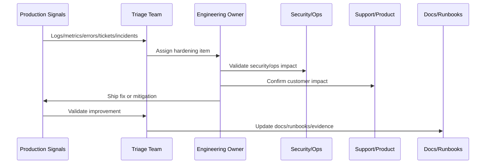

# Post-Launch Smoke Validation

> *"Defines post-launch smoke validation for core workflows, auth, workspace access, inbox, replies, tickets, integrations, AI, background jobs, and support/admin flows."*

---

# Purpose

Defines post-launch smoke validation for core workflows, auth, workspace access, inbox, replies, tickets, integrations, AI, background jobs, and support/admin flows.

---

# Hardening Problem

Without post-launch smoke checks, production defects may remain undetected until customers report them.

---

# Hardening Decision

## Decision

CLARA should run structured smoke validation immediately after launch and after major production changes to confirm core workflows behave correctly.

## Status

Accepted.

---

# Production Hardening Rule

Every CLARA post-launch issue should move through:

```text
Evidence -> Triage -> Impact Assessment -> Owner Assignment -> Fix/Hardening Plan -> Validation -> Documentation/Runbook Update -> Review
```

A hardening item is not ready to close if it cannot answer:

```text
what evidence triggered it
what customer or operational impact exists
what root cause or likely cause was identified
who owns the fix
what acceptance criteria prove improvement
what test or monitor prevents regression
what documentation/runbook changed
how priority was decided
```

---

# Recommended Hardening Flow



---

# Production-Ready Checklist

- [ ] Evidence source is recorded.
- [ ] Impact is classified.
- [ ] Owner is assigned.
- [ ] Priority is justified.
- [ ] Fix or mitigation is defined.
- [ ] Validation method exists.
- [ ] Regression protection exists.
- [ ] Security impact is reviewed where needed.
- [ ] Support communication is updated where needed.
- [ ] Documentation/runbook updates are completed.

---

# Acceptance Criteria

- [ ] Production evidence is used.
- [ ] Customer impact is considered.
- [ ] Security and reliability risks are included.
- [ ] Hardening actions are owned.
- [ ] Validation criteria are measurable.
- [ ] Knowledge is captured.
- [ ] AI coding assistants can apply this safely.

---

# Anti-patterns

Avoid:

- Treating launch as complete without post-launch validation.
- Closing issues without evidence.
- Prioritizing only loud bugs instead of high-risk issues.
- Ignoring support tickets as engineering signals.
- Hardening without tests or monitoring.
- Security findings without owners.
- Performance work without baselines.
- AI quality issues without prompt/test updates.
- Integration DLQs with no reprocessing owner.
- Retrospectives that produce no action items.

---

# Related Documents

- ../PART-10-Production-Launch-Plan/README.md
- ../PART-09-CI-CD-and-Environment-Implementation/README.md
- ../PART-08-Testing-and-Quality-Implementation/README.md
- ../../BOOK-07-Operations-Observability-and-Reliability/BOOK-07-Master-Index/README.md
- ../../BOOK-06-Security-Governance-and-Compliance/BOOK-06-Master-Index/README.md

---

# Navigation

**Previous:** `121-Production-Validation-and-Hardening-Overview.md`

**Next:** `123-Production-Telemetry-Review.md`

---

# Post-Launch Smoke Scope

Validate:

```text
login
session refresh/expiry
workspace switch
inbox load
conversation open
send reply
ticket create/update
AI draft generation if enabled
integration webhook receive
background worker processing
support/admin critical path
```

---

# Smoke Validation Record

Track:

```text
test name
owner
environment
timestamp
result
evidence link
issue found
severity
follow-up owner
```

---

# Smoke Test Timing

Run smoke tests:

```text
immediately after launch
after major hotfix
after migration
after feature flag enablement
after provider/integration cutover
after rollback/forward-fix
```

---

# Smoke Rule

Smoke validation should test customer-impacting workflows, not just whether the server responds.
