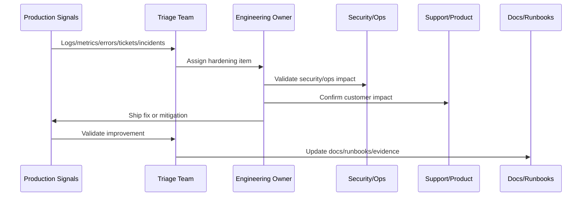

# Production Telemetry Review

> *"Defines production telemetry review for logs, metrics, traces, dashboards, SLOs, frontend errors, backend errors, queue lag, database performance, AI cost, and integrations."*

---

# Purpose

Defines production telemetry review for logs, metrics, traces, dashboards, SLOs, frontend errors, backend errors, queue lag, database performance, AI cost, and integrations.

---

# Hardening Problem

Production telemetry is often the first evidence that implementation assumptions were wrong.

---

# Hardening Decision

## Decision

CLARA should review production telemetry after launch to verify system health, customer impact, performance, and reliability against expected baselines.

## Status

Accepted.

---

# Production Hardening Rule

Every CLARA post-launch issue should move through:

```text
Evidence -> Triage -> Impact Assessment -> Owner Assignment -> Fix/Hardening Plan -> Validation -> Documentation/Runbook Update -> Review
```

A hardening item is not ready to close if it cannot answer:

```text
what evidence triggered it
what customer or operational impact exists
what root cause or likely cause was identified
who owns the fix
what acceptance criteria prove improvement
what test or monitor prevents regression
what documentation/runbook changed
how priority was decided
```

---

# Recommended Hardening Flow



---

# Production-Ready Checklist

- [ ] Evidence source is recorded.
- [ ] Impact is classified.
- [ ] Owner is assigned.
- [ ] Priority is justified.
- [ ] Fix or mitigation is defined.
- [ ] Validation method exists.
- [ ] Regression protection exists.
- [ ] Security impact is reviewed where needed.
- [ ] Support communication is updated where needed.
- [ ] Documentation/runbook updates are completed.

---

# Acceptance Criteria

- [ ] Production evidence is used.
- [ ] Customer impact is considered.
- [ ] Security and reliability risks are included.
- [ ] Hardening actions are owned.
- [ ] Validation criteria are measurable.
- [ ] Knowledge is captured.
- [ ] AI coding assistants can apply this safely.

---

# Anti-patterns

Avoid:

- Treating launch as complete without post-launch validation.
- Closing issues without evidence.
- Prioritizing only loud bugs instead of high-risk issues.
- Ignoring support tickets as engineering signals.
- Hardening without tests or monitoring.
- Security findings without owners.
- Performance work without baselines.
- AI quality issues without prompt/test updates.
- Integration DLQs with no reprocessing owner.
- Retrospectives that produce no action items.

---

# Related Documents

- ../PART-10-Production-Launch-Plan/README.md
- ../PART-09-CI-CD-and-Environment-Implementation/README.md
- ../PART-08-Testing-and-Quality-Implementation/README.md
- ../../BOOK-07-Operations-Observability-and-Reliability/BOOK-07-Master-Index/README.md
- ../../BOOK-06-Security-Governance-and-Compliance/BOOK-06-Master-Index/README.md

---

# Navigation

**Previous:** `122-Post-Launch-Smoke-Validation.md`

**Next:** `124-Incident-and-Defect-Triage.md`

---

# Telemetry Review Areas

Review:

```text
API error rate
API latency
frontend route errors
database slow queries
queue lag
worker error rate
integration webhook failure rate
dead-letter backlog
AI error/cost/safety block rate
auth failure patterns
authorization denied patterns
SLO burn rate
```

---

# Baseline Comparison

Compare production to:

```text
staging expectations
load test baseline
pre-launch performance budget
SLO targets
expected launch traffic
known provider behavior
```

---

# Telemetry Review Questions

```text
Are users completing critical workflows?
Are errors concentrated in one workspace/provider/role?
Are queues keeping up?
Are database queries degrading?
Are AI costs within budget?
Are integrations receiving and processing events?
Are security signals normal?
```

---

# Telemetry Rule

A green deploy is not enough. Production telemetry must show healthy customer experience.
