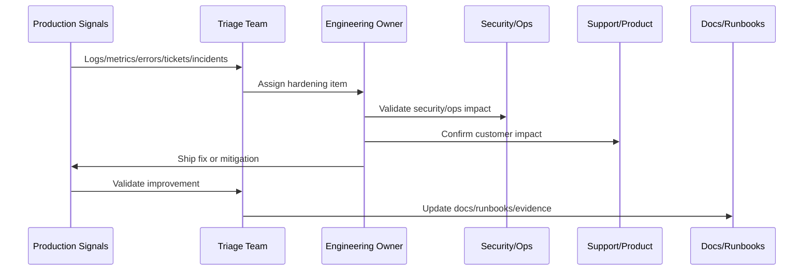

# Incident and Defect Triage

> *"Defines incident and defect triage after launch, including severity, ownership, reproduction, customer impact, escalation, fix priority, and evidence capture."*

---

# Purpose

Defines incident and defect triage after launch, including severity, ownership, reproduction, customer impact, escalation, fix priority, and evidence capture.

---

# Hardening Problem

Unstructured defect triage causes teams to chase noise while missing high-impact production issues.

---

# Hardening Decision

## Decision

CLARA should triage post-launch incidents and defects through a clear process that separates urgent customer-impacting incidents from planned hardening work.

## Status

Accepted.

---

# Production Hardening Rule

Every CLARA post-launch issue should move through:

```text
Evidence -> Triage -> Impact Assessment -> Owner Assignment -> Fix/Hardening Plan -> Validation -> Documentation/Runbook Update -> Review
```

A hardening item is not ready to close if it cannot answer:

```text
what evidence triggered it
what customer or operational impact exists
what root cause or likely cause was identified
who owns the fix
what acceptance criteria prove improvement
what test or monitor prevents regression
what documentation/runbook changed
how priority was decided
```

---

# Recommended Hardening Flow



---

# Production-Ready Checklist

- [ ] Evidence source is recorded.
- [ ] Impact is classified.
- [ ] Owner is assigned.
- [ ] Priority is justified.
- [ ] Fix or mitigation is defined.
- [ ] Validation method exists.
- [ ] Regression protection exists.
- [ ] Security impact is reviewed where needed.
- [ ] Support communication is updated where needed.
- [ ] Documentation/runbook updates are completed.

---

# Acceptance Criteria

- [ ] Production evidence is used.
- [ ] Customer impact is considered.
- [ ] Security and reliability risks are included.
- [ ] Hardening actions are owned.
- [ ] Validation criteria are measurable.
- [ ] Knowledge is captured.
- [ ] AI coding assistants can apply this safely.

---

# Anti-patterns

Avoid:

- Treating launch as complete without post-launch validation.
- Closing issues without evidence.
- Prioritizing only loud bugs instead of high-risk issues.
- Ignoring support tickets as engineering signals.
- Hardening without tests or monitoring.
- Security findings without owners.
- Performance work without baselines.
- AI quality issues without prompt/test updates.
- Integration DLQs with no reprocessing owner.
- Retrospectives that produce no action items.

---

# Related Documents

- ../PART-10-Production-Launch-Plan/README.md
- ../PART-09-CI-CD-and-Environment-Implementation/README.md
- ../PART-08-Testing-and-Quality-Implementation/README.md
- ../../BOOK-07-Operations-Observability-and-Reliability/BOOK-07-Master-Index/README.md
- ../../BOOK-06-Security-Governance-and-Compliance/BOOK-06-Master-Index/README.md

---

# Navigation

**Previous:** `123-Production-Telemetry-Review.md`

**Next:** `125-Security-Hardening-Pass.md`

---

# Triage Categories

Classify issues as:

```text
incident
launch blocker
high-priority defect
normal defect
known limitation
support documentation issue
monitoring gap
hardening improvement
false positive/no action
```

---

# Severity Model

Recommended:

```text
SEV-1 critical customer/system impact
SEV-2 major degraded workflow
SEV-3 limited workflow impact
SEV-4 minor defect or low-risk issue
SEV-5 improvement/documentation
```

---

# Triage Checklist

- [ ] Evidence captured.
- [ ] Customer impact assessed.
- [ ] Severity assigned.
- [ ] Owner assigned.
- [ ] Workaround identified if possible.
- [ ] Incident declared if needed.
- [ ] Communication owner assigned if customer-facing.
- [ ] Follow-up item created.

---

# Triage Rule

Do not let all issues become equal priority. Production triage is risk management.
