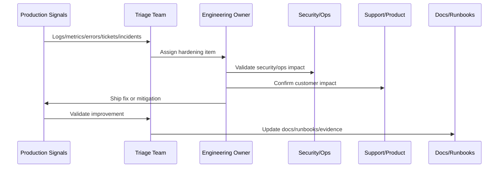

# Security Hardening Pass

> *"Defines post-launch security hardening across auth, authorization, secrets, dependencies, logs, audit events, integrations, AI, production access, and security monitoring."*

---

# Purpose

Defines post-launch security hardening across auth, authorization, secrets, dependencies, logs, audit events, integrations, AI, production access, and security monitoring.

---

# Hardening Problem

Production usage reveals security edge cases that design-time reviews and tests may miss.

---

# Hardening Decision

## Decision

CLARA should perform a security hardening pass after launch to close gaps discovered through telemetry, scans, review, support evidence, and production behavior.

## Status

Accepted.

---

# Production Hardening Rule

Every CLARA post-launch issue should move through:

```text
Evidence -> Triage -> Impact Assessment -> Owner Assignment -> Fix/Hardening Plan -> Validation -> Documentation/Runbook Update -> Review
```

A hardening item is not ready to close if it cannot answer:

```text
what evidence triggered it
what customer or operational impact exists
what root cause or likely cause was identified
who owns the fix
what acceptance criteria prove improvement
what test or monitor prevents regression
what documentation/runbook changed
how priority was decided
```

---

# Recommended Hardening Flow



---

# Production-Ready Checklist

- [ ] Evidence source is recorded.
- [ ] Impact is classified.
- [ ] Owner is assigned.
- [ ] Priority is justified.
- [ ] Fix or mitigation is defined.
- [ ] Validation method exists.
- [ ] Regression protection exists.
- [ ] Security impact is reviewed where needed.
- [ ] Support communication is updated where needed.
- [ ] Documentation/runbook updates are completed.

---

# Acceptance Criteria

- [ ] Production evidence is used.
- [ ] Customer impact is considered.
- [ ] Security and reliability risks are included.
- [ ] Hardening actions are owned.
- [ ] Validation criteria are measurable.
- [ ] Knowledge is captured.
- [ ] AI coding assistants can apply this safely.

---

# Anti-patterns

Avoid:

- Treating launch as complete without post-launch validation.
- Closing issues without evidence.
- Prioritizing only loud bugs instead of high-risk issues.
- Ignoring support tickets as engineering signals.
- Hardening without tests or monitoring.
- Security findings without owners.
- Performance work without baselines.
- AI quality issues without prompt/test updates.
- Integration DLQs with no reprocessing owner.
- Retrospectives that produce no action items.

---

# Related Documents

- ../PART-10-Production-Launch-Plan/README.md
- ../PART-09-CI-CD-and-Environment-Implementation/README.md
- ../PART-08-Testing-and-Quality-Implementation/README.md
- ../../BOOK-07-Operations-Observability-and-Reliability/BOOK-07-Master-Index/README.md
- ../../BOOK-06-Security-Governance-and-Compliance/BOOK-06-Master-Index/README.md

---

# Navigation

**Previous:** `124-Incident-and-Defect-Triage.md`

**Next:** `126-Performance-Hardening-Pass.md`

---

# Security Hardening Areas

Review:

```text
authentication failures
authorization/IDOR edge cases
tenant/workspace isolation
production access logs
secret usage and rotation needs
dependency vulnerabilities
security headers/CSP readiness
webhook verification failures
AI prompt injection attempts
audit event completeness
sensitive data in logs/telemetry
```

---

# Security Hardening Actions

Examples:

```text
tighten authorization policy
add missing audit event
redact sensitive log field
rotate exposed/overused credential
patch vulnerable dependency
rate limit abusive endpoint
add webhook replay control
add AI output validator
restrict support/admin access
```

---

# Security Validation

Validate through:

```text
security tests
manual review
log review
audit review
dependency scan
secret scan
access review
abuse-case testing
```

---

# Security Hardening Rule

A security issue should close only after the fix, validation, and regression protection are documented.
