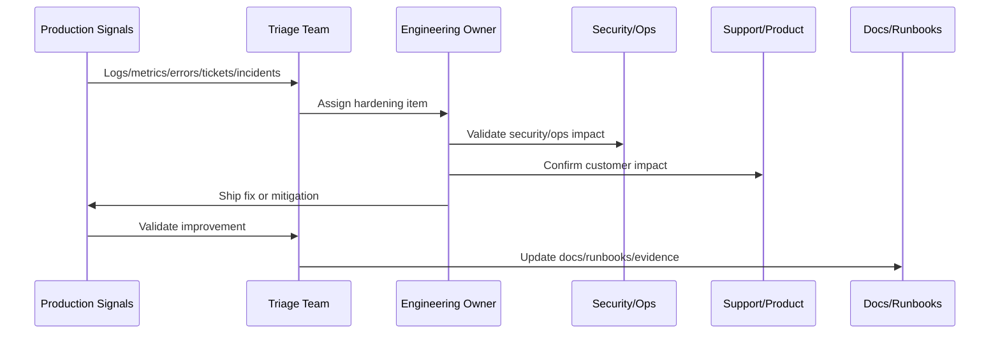

# AI and Integration Hardening Pass

> *"Defines hardening for AI Gateway, prompts, RAG, guardrails, human review, automation, provider adapters, webhooks, retries, DLQ, and integration observability."*

---

# Purpose

Defines hardening for AI Gateway, prompts, RAG, guardrails, human review, automation, provider adapters, webhooks, retries, DLQ, and integration observability.

---

# Hardening Problem

AI and external integrations are dynamic risk surfaces that need continuous hardening after production exposure.

---

# Hardening Decision

## Decision

CLARA should harden AI and integrations after launch using review outcomes, provider behavior, customer feedback, safety events, cost signals, and failure evidence.

## Status

Accepted.

---

# Production Hardening Rule

Every CLARA post-launch issue should move through:

```text
Evidence -> Triage -> Impact Assessment -> Owner Assignment -> Fix/Hardening Plan -> Validation -> Documentation/Runbook Update -> Review
```

A hardening item is not ready to close if it cannot answer:

```text
what evidence triggered it
what customer or operational impact exists
what root cause or likely cause was identified
who owns the fix
what acceptance criteria prove improvement
what test or monitor prevents regression
what documentation/runbook changed
how priority was decided
```

---

# Recommended Hardening Flow



---

# Production-Ready Checklist

- [ ] Evidence source is recorded.
- [ ] Impact is classified.
- [ ] Owner is assigned.
- [ ] Priority is justified.
- [ ] Fix or mitigation is defined.
- [ ] Validation method exists.
- [ ] Regression protection exists.
- [ ] Security impact is reviewed where needed.
- [ ] Support communication is updated where needed.
- [ ] Documentation/runbook updates are completed.

---

# Acceptance Criteria

- [ ] Production evidence is used.
- [ ] Customer impact is considered.
- [ ] Security and reliability risks are included.
- [ ] Hardening actions are owned.
- [ ] Validation criteria are measurable.
- [ ] Knowledge is captured.
- [ ] AI coding assistants can apply this safely.

---

# Anti-patterns

Avoid:

- Treating launch as complete without post-launch validation.
- Closing issues without evidence.
- Prioritizing only loud bugs instead of high-risk issues.
- Ignoring support tickets as engineering signals.
- Hardening without tests or monitoring.
- Security findings without owners.
- Performance work without baselines.
- AI quality issues without prompt/test updates.
- Integration DLQs with no reprocessing owner.
- Retrospectives that produce no action items.

---

# Related Documents

- ../PART-10-Production-Launch-Plan/README.md
- ../PART-09-CI-CD-and-Environment-Implementation/README.md
- ../PART-08-Testing-and-Quality-Implementation/README.md
- ../../BOOK-07-Operations-Observability-and-Reliability/BOOK-07-Master-Index/README.md
- ../../BOOK-06-Security-Governance-and-Compliance/BOOK-06-Master-Index/README.md

---

# Navigation

**Previous:** `127-Reliability-Hardening-Pass.md`

**Next:** `129-Customer-Feedback-and-Support-Loop.md`

---

# AI Hardening Areas

Review:

```text
prompt quality
RAG relevance
wrong context retrieval
guardrail misses
human review rejection/edit rate
hallucination reports
safety block rate
AI latency
token/cost usage
kill switch behavior
```

---

# Integration Hardening Areas

Review:

```text
signature failures
duplicate events
replay attempts
provider errors
rate limits
dead-letter backlog
normalization failures
attachment failures
sandbox-production differences
support escalation patterns
```

---

# Hardening Actions

Examples:

```text
update prompt template
add evaluation cases
tighten RAG scoping
add output schema validator
lower automation permission
adjust provider retry policy
improve idempotency
add DLQ reprocessing runbook
improve integration dashboard
```

---

# AI/Integration Rule

AI and integrations should launch conservatively, then expand only when production evidence supports it.
