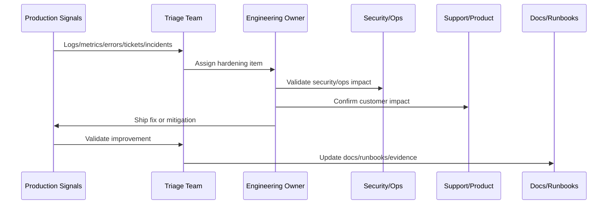
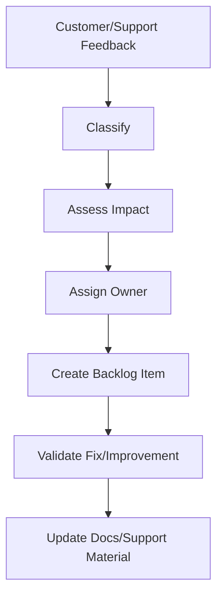

# Customer Feedback and Support Loop

> *"Defines how customer feedback, support tickets, known issues, product insights, UX friction, and support escalations feed the hardening backlog."*

---

# Purpose

Defines how customer feedback, support tickets, known issues, product insights, UX friction, and support escalations feed the hardening backlog.

---

# Hardening Problem

Support feedback is often the clearest signal of real user pain that metrics alone do not explain.

---

# Hardening Decision

## Decision

CLARA should use customer and support feedback as production evidence that informs product, engineering, reliability, and documentation improvements.

## Status

Accepted.

---

# Production Hardening Rule

Every CLARA post-launch issue should move through:

```text
Evidence -> Triage -> Impact Assessment -> Owner Assignment -> Fix/Hardening Plan -> Validation -> Documentation/Runbook Update -> Review
```

A hardening item is not ready to close if it cannot answer:

```text
what evidence triggered it
what customer or operational impact exists
what root cause or likely cause was identified
who owns the fix
what acceptance criteria prove improvement
what test or monitor prevents regression
what documentation/runbook changed
how priority was decided
```

---

# Recommended Hardening Flow



---

# Production-Ready Checklist

- [ ] Evidence source is recorded.
- [ ] Impact is classified.
- [ ] Owner is assigned.
- [ ] Priority is justified.
- [ ] Fix or mitigation is defined.
- [ ] Validation method exists.
- [ ] Regression protection exists.
- [ ] Security impact is reviewed where needed.
- [ ] Support communication is updated where needed.
- [ ] Documentation/runbook updates are completed.

---

# Acceptance Criteria

- [ ] Production evidence is used.
- [ ] Customer impact is considered.
- [ ] Security and reliability risks are included.
- [ ] Hardening actions are owned.
- [ ] Validation criteria are measurable.
- [ ] Knowledge is captured.
- [ ] AI coding assistants can apply this safely.

---

# Anti-patterns

Avoid:

- Treating launch as complete without post-launch validation.
- Closing issues without evidence.
- Prioritizing only loud bugs instead of high-risk issues.
- Ignoring support tickets as engineering signals.
- Hardening without tests or monitoring.
- Security findings without owners.
- Performance work without baselines.
- AI quality issues without prompt/test updates.
- Integration DLQs with no reprocessing owner.
- Retrospectives that produce no action items.

---

# Related Documents

- ../PART-10-Production-Launch-Plan/README.md
- ../PART-09-CI-CD-and-Environment-Implementation/README.md
- ../PART-08-Testing-and-Quality-Implementation/README.md
- ../../BOOK-07-Operations-Observability-and-Reliability/BOOK-07-Master-Index/README.md
- ../../BOOK-06-Security-Governance-and-Compliance/BOOK-06-Master-Index/README.md

---

# Navigation

**Previous:** `128-AI-and-Integration-Hardening-Pass.md`

**Next:** `130-Launch-Retrospective-and-Learning-Capture.md`

---

# Feedback Sources

Use:

```text
support tickets
customer calls
bug reports
feature requests
NPS/CSAT comments
sales/customer success notes
community feedback
in-app feedback
known issue reports
incident follow-ups
```

---

# Feedback Classification

Classify feedback as:

```text
bug
UX confusion
performance pain
missing feature
integration issue
AI quality issue
documentation gap
support tooling gap
security/privacy concern
reliability issue
```

---

# Feedback to Backlog Flow



---

# Feedback Rule

Support feedback is production telemetry with human context.
