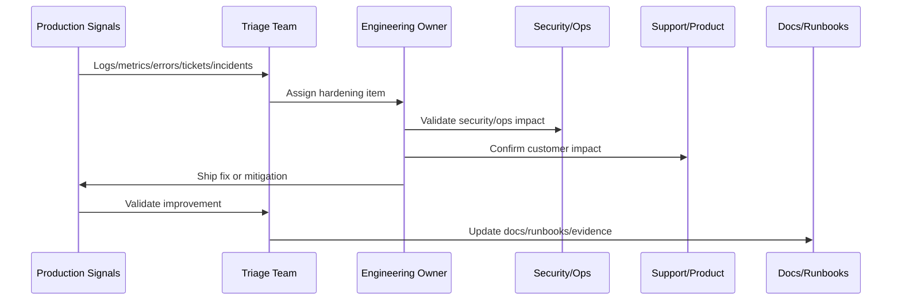

# Launch Retrospective and Learning Capture

> *"Defines launch retrospective process, learning capture, timeline review, what went well, what failed, root causes, action items, and documentation updates."*

---

# Purpose

Defines launch retrospective process, learning capture, timeline review, what went well, what failed, root causes, action items, and documentation updates.

---

# Hardening Problem

Without retrospective discipline, the team repeats the same launch mistakes in future releases.

---

# Hardening Decision

## Decision

CLARA should run a blameless launch retrospective to convert launch experience into better systems, processes, documentation, and readiness gates.

## Status

Accepted.

---

# Production Hardening Rule

Every CLARA post-launch issue should move through:

```text
Evidence -> Triage -> Impact Assessment -> Owner Assignment -> Fix/Hardening Plan -> Validation -> Documentation/Runbook Update -> Review
```

A hardening item is not ready to close if it cannot answer:

```text
what evidence triggered it
what customer or operational impact exists
what root cause or likely cause was identified
who owns the fix
what acceptance criteria prove improvement
what test or monitor prevents regression
what documentation/runbook changed
how priority was decided
```

---

# Recommended Hardening Flow



---

# Production-Ready Checklist

- [ ] Evidence source is recorded.
- [ ] Impact is classified.
- [ ] Owner is assigned.
- [ ] Priority is justified.
- [ ] Fix or mitigation is defined.
- [ ] Validation method exists.
- [ ] Regression protection exists.
- [ ] Security impact is reviewed where needed.
- [ ] Support communication is updated where needed.
- [ ] Documentation/runbook updates are completed.

---

# Acceptance Criteria

- [ ] Production evidence is used.
- [ ] Customer impact is considered.
- [ ] Security and reliability risks are included.
- [ ] Hardening actions are owned.
- [ ] Validation criteria are measurable.
- [ ] Knowledge is captured.
- [ ] AI coding assistants can apply this safely.

---

# Anti-patterns

Avoid:

- Treating launch as complete without post-launch validation.
- Closing issues without evidence.
- Prioritizing only loud bugs instead of high-risk issues.
- Ignoring support tickets as engineering signals.
- Hardening without tests or monitoring.
- Security findings without owners.
- Performance work without baselines.
- AI quality issues without prompt/test updates.
- Integration DLQs with no reprocessing owner.
- Retrospectives that produce no action items.

---

# Related Documents

- ../PART-10-Production-Launch-Plan/README.md
- ../PART-09-CI-CD-and-Environment-Implementation/README.md
- ../PART-08-Testing-and-Quality-Implementation/README.md
- ../../BOOK-07-Operations-Observability-and-Reliability/BOOK-07-Master-Index/README.md
- ../../BOOK-06-Security-Governance-and-Compliance/BOOK-06-Master-Index/README.md

---

# Navigation

**Previous:** `129-Customer-Feedback-and-Support-Loop.md`

**Next:** `131-Hardening-Roadmap-and-Prioritization.md`

---

# Retrospective Template

Discuss:

```text
what went well
what did not go well
what surprised us
what risks were accepted
what incidents/defects happened
what customer impact occurred
what evidence was missing
what should change before next launch
```

---

# Timeline Review

Capture:

```text
readiness review
go/no-go decision
deployment start/end
smoke validation
first issue detected
triage actions
rollback/hotfix decisions
stabilization outcome
```

---

# Action Item Requirements

Each action item should have:

```text
owner
priority
due date
acceptance criteria
evidence required
related doc/runbook/test update
```

---

# Retrospective Rule

Blameless does not mean actionless.
