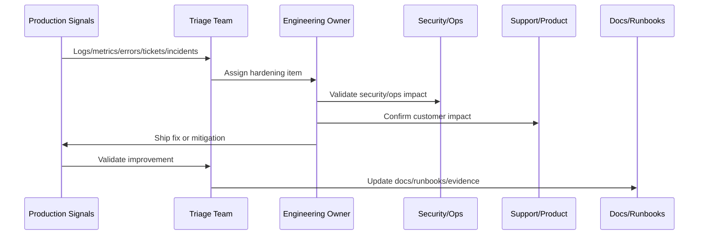

# Hardening Roadmap and Prioritization

> *"Defines hardening roadmap creation, prioritization model, risk scoring, owner assignment, timelines, acceptance criteria, and progress review cadence."*

---

# Purpose

Defines hardening roadmap creation, prioritization model, risk scoring, owner assignment, timelines, acceptance criteria, and progress review cadence.

---

# Hardening Problem

Hardening work gets ignored when it is not prioritized, owned, and reviewed like product work.

---

# Hardening Decision

## Decision

CLARA should maintain a hardening roadmap that prioritizes customer impact, security risk, reliability risk, operational toil, and delivery cost.

## Status

Accepted.

---

# Production Hardening Rule

Every CLARA post-launch issue should move through:

```text
Evidence -> Triage -> Impact Assessment -> Owner Assignment -> Fix/Hardening Plan -> Validation -> Documentation/Runbook Update -> Review
```

A hardening item is not ready to close if it cannot answer:

```text
what evidence triggered it
what customer or operational impact exists
what root cause or likely cause was identified
who owns the fix
what acceptance criteria prove improvement
what test or monitor prevents regression
what documentation/runbook changed
how priority was decided
```

---

# Recommended Hardening Flow



---

# Production-Ready Checklist

- [ ] Evidence source is recorded.
- [ ] Impact is classified.
- [ ] Owner is assigned.
- [ ] Priority is justified.
- [ ] Fix or mitigation is defined.
- [ ] Validation method exists.
- [ ] Regression protection exists.
- [ ] Security impact is reviewed where needed.
- [ ] Support communication is updated where needed.
- [ ] Documentation/runbook updates are completed.

---

# Acceptance Criteria

- [ ] Production evidence is used.
- [ ] Customer impact is considered.
- [ ] Security and reliability risks are included.
- [ ] Hardening actions are owned.
- [ ] Validation criteria are measurable.
- [ ] Knowledge is captured.
- [ ] AI coding assistants can apply this safely.

---

# Anti-patterns

Avoid:

- Treating launch as complete without post-launch validation.
- Closing issues without evidence.
- Prioritizing only loud bugs instead of high-risk issues.
- Ignoring support tickets as engineering signals.
- Hardening without tests or monitoring.
- Security findings without owners.
- Performance work without baselines.
- AI quality issues without prompt/test updates.
- Integration DLQs with no reprocessing owner.
- Retrospectives that produce no action items.

---

# Related Documents

- ../PART-10-Production-Launch-Plan/README.md
- ../PART-09-CI-CD-and-Environment-Implementation/README.md
- ../PART-08-Testing-and-Quality-Implementation/README.md
- ../../BOOK-07-Operations-Observability-and-Reliability/BOOK-07-Master-Index/README.md
- ../../BOOK-06-Security-Governance-and-Compliance/BOOK-06-Master-Index/README.md

---

# Navigation

**Previous:** `130-Launch-Retrospective-and-Learning-Capture.md`

**Next:** `132-Part-11-Summary.md`

---

# Hardening Prioritization Model

Prioritize using:

```text
customer impact
security risk
reliability risk
data integrity risk
operational toil
frequency
blast radius
regression risk
implementation cost
strategic importance
```

---

# Roadmap Buckets

Organize into:

```text
immediate hotfix
launch stabilization
security hardening
performance hardening
reliability hardening
AI/integration hardening
support/product improvement
documentation/runbook update
long-term architecture improvement
```

---

# Roadmap Item Template

```markdown
## Hardening Item

Title:
Evidence:
Impact:
Risk:
Owner:
Priority:
Target date:
Acceptance criteria:
Validation method:
Docs/runbook/test update:
```

---

# Roadmap Rule

Hardening roadmap items should compete on risk and impact, not only on who shouts loudest.
