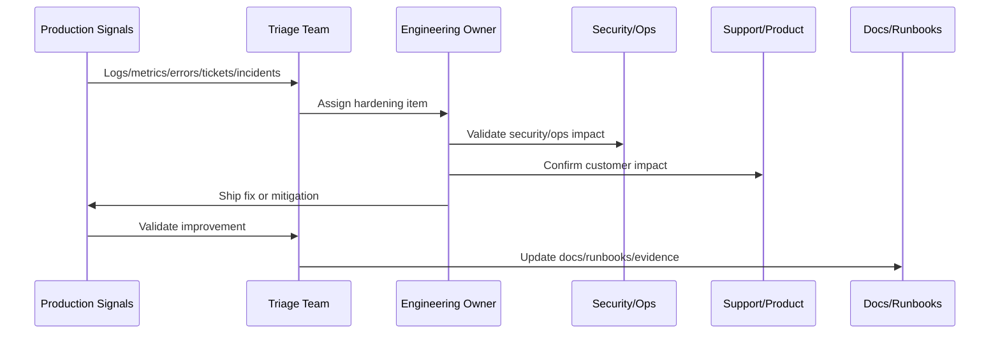

# Part 11 Summary

> *"Summarizes Production Validation and Hardening and prepares for Book VIII Part 12."*

---

# Purpose

Summarizes Production Validation and Hardening and prepares for Book VIII Part 12.

---

# Hardening Problem

Implementation Handover and Master Index comes next because Book VIII needs a formal closure, ownership transfer, final map, and next-step bridge after launch and hardening.

---

# Hardening Decision

## Decision

CLARA should proceed to Implementation Handover and Master Index after defining production validation, smoke checks, telemetry review, triage, security hardening, performance hardening, reliability hardening, AI/integration hardening, feedback loop, retrospective, and hardening roadmap.

## Status

Accepted.

---

# Production Hardening Rule

Every CLARA post-launch issue should move through:

```text
Evidence -> Triage -> Impact Assessment -> Owner Assignment -> Fix/Hardening Plan -> Validation -> Documentation/Runbook Update -> Review
```

A hardening item is not ready to close if it cannot answer:

```text
what evidence triggered it
what customer or operational impact exists
what root cause or likely cause was identified
who owns the fix
what acceptance criteria prove improvement
what test or monitor prevents regression
what documentation/runbook changed
how priority was decided
```

---

# Recommended Hardening Flow



---

# Production-Ready Checklist

- [ ] Evidence source is recorded.
- [ ] Impact is classified.
- [ ] Owner is assigned.
- [ ] Priority is justified.
- [ ] Fix or mitigation is defined.
- [ ] Validation method exists.
- [ ] Regression protection exists.
- [ ] Security impact is reviewed where needed.
- [ ] Support communication is updated where needed.
- [ ] Documentation/runbook updates are completed.

---

# Acceptance Criteria

- [ ] Production evidence is used.
- [ ] Customer impact is considered.
- [ ] Security and reliability risks are included.
- [ ] Hardening actions are owned.
- [ ] Validation criteria are measurable.
- [ ] Knowledge is captured.
- [ ] AI coding assistants can apply this safely.

---

# Anti-patterns

Avoid:

- Treating launch as complete without post-launch validation.
- Closing issues without evidence.
- Prioritizing only loud bugs instead of high-risk issues.
- Ignoring support tickets as engineering signals.
- Hardening without tests or monitoring.
- Security findings without owners.
- Performance work without baselines.
- AI quality issues without prompt/test updates.
- Integration DLQs with no reprocessing owner.
- Retrospectives that produce no action items.

---

# Related Documents

- ../PART-10-Production-Launch-Plan/README.md
- ../PART-09-CI-CD-and-Environment-Implementation/README.md
- ../PART-08-Testing-and-Quality-Implementation/README.md
- ../../BOOK-07-Operations-Observability-and-Reliability/BOOK-07-Master-Index/README.md
- ../../BOOK-06-Security-Governance-and-Compliance/BOOK-06-Master-Index/README.md

---

# Navigation

**Previous:** `131-Hardening-Roadmap-and-Prioritization.md`

**Next:** `../PART-12-Implementation-Handover-and-Master-Index/README.md`

---

# Part 11 Completion

Part 11 establishes:

- Production validation and hardening overview.
- Post-launch smoke validation.
- Production telemetry review.
- Incident and defect triage.
- Security hardening pass.
- Performance hardening pass.
- Reliability hardening pass.
- AI and integration hardening pass.
- Customer feedback and support loop.
- Launch retrospective and learning capture.
- Hardening roadmap and prioritization.

---

# Ready for Part 12

The next part should be:

```text
BOOK VIII — PART 12: Implementation Handover and Master Index
```

It should define:

- Implementation handover overview.
- Repository and module handover.
- Backend implementation handover.
- Frontend/client implementation handover.
- Database/migration handover.
- AI/automation handover.
- Integration/webhook handover.
- Testing/quality handover.
- CI/CD/environment handover.
- Launch and hardening handover.
- Book VIII closure.
- Part 12 summary.
