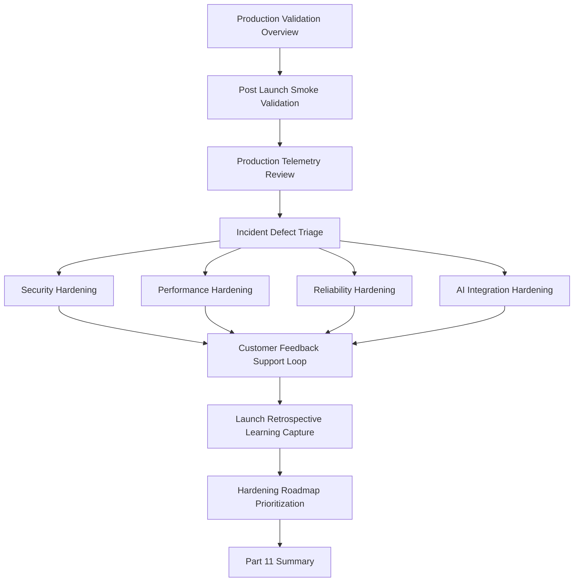

# PART-11 — Production Validation and Hardening

> *"Production launch is not the finish line. It is the first real-world test."*

---

# Purpose

Part 11 defines CLARA's production validation and hardening standards.

It covers:

- Production Validation and Hardening overview.
- Post-Launch Smoke Validation.
- Production Telemetry Review.
- Incident and Defect Triage.
- Security Hardening Pass.
- Performance Hardening Pass.
- Reliability Hardening Pass.
- AI and Integration Hardening Pass.
- Customer Feedback and Support Loop.
- Launch Retrospective and Learning Capture.
- Hardening Roadmap and Prioritization.
- Part 11 Summary.

---

# Chapter Map

| Chapter | Title |
|---:|---|
| 121 | Production Validation and Hardening Overview |
| 122 | Post-Launch Smoke Validation |
| 123 | Production Telemetry Review |
| 124 | Incident and Defect Triage |
| 125 | Security Hardening Pass |
| 126 | Performance Hardening Pass |
| 127 | Reliability Hardening Pass |
| 128 | AI and Integration Hardening Pass |
| 129 | Customer Feedback and Support Loop |
| 130 | Launch Retrospective and Learning Capture |
| 131 | Hardening Roadmap and Prioritization |
| 132 | Part 11 Summary |

---

# Production Validation Map



---

# Hardening Non-Negotiables

CLARA production hardening must enforce:

```text
post-launch smoke validation
real telemetry review
incident/defect triage
security hardening
performance hardening
reliability hardening
AI/integration hardening
support feedback loop
blameless retrospective
owner-assigned hardening roadmap
evidence-driven prioritization
updated runbooks and documentation
```

---

# Relationship to Previous Parts

Part 10 defines production launch planning.

Part 11 defines what happens after launch: validate reality, learn from evidence, harden weak areas, and prepare handover.

---

# Navigation

**Previous:** `../PART-10-Production-Launch-Plan/120-Part-10-Summary.md`

**Next:** `121-Production-Validation-and-Hardening-Overview.md`
