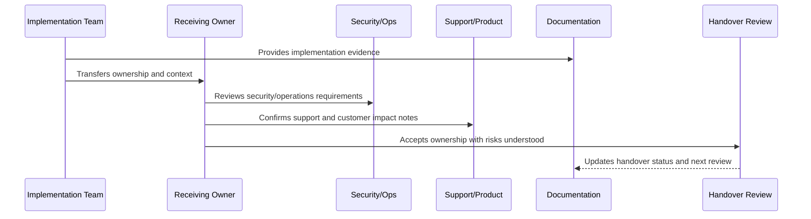

# AI and Automation Handover

> *"Defines AI Gateway and automation handover for provider adapters, prompts, RAG/context, guardrails, human review, telemetry, cost tracking, automations, fallback, and kill switches."*

---

# Purpose

Defines AI Gateway and automation handover for provider adapters, prompts, RAG/context, guardrails, human review, telemetry, cost tracking, automations, fallback, and kill switches.

---

# Handover Problem

AI and automation features remain high-risk if the owning team does not understand how to review, monitor, and disable them safely.

---

# Handover Decision

## Decision

CLARA AI and automation handover should ensure owners understand model/provider behavior, prompt versions, safety controls, review requirements, cost controls, and emergency disablement.

## Status

Accepted.

---

# Implementation Handover Rule

Every CLARA implementation area should be handed over with:

```text
owner
backup owner
scope
architecture/design reference
security reference
operations reference
tests and quality gates
CI/CD or release path
known risks
open hardening items
support/runbook links
acceptance evidence
next review date
```

A handover is not complete if it cannot answer:

```text
who owns this area now
where the code lives
how to run and test it
how to deploy it
how to observe it
how to recover it
how to secure it
what risks remain
what docs/runbooks explain it
what evidence proves readiness
```

---

# Recommended Handover Flow



---

# Production-Ready Checklist

- [ ] Owner and backup owner are assigned.
- [ ] Code location is documented.
- [ ] Scope and boundaries are clear.
- [ ] Security notes are included.
- [ ] Tests and quality gates are documented.
- [ ] Deployment path is clear.
- [ ] Observability/dashboard links are included.
- [ ] Runbooks/support docs are linked.
- [ ] Known risks are documented.
- [ ] Open hardening items are linked.
- [ ] Receiving owner accepts responsibility.

---

# Acceptance Criteria

- [ ] Handover is actionable.
- [ ] Future maintainers can find the right docs.
- [ ] Security and operational responsibilities are clear.
- [ ] Risks are visible.
- [ ] Evidence is preserved.
- [ ] Next step toward master index is clear.
- [ ] AI coding assistants can apply this safely.

---

# Anti-patterns

Avoid:

- “Ask the original developer” as the handover plan.
- No backup owner.
- No test command documentation.
- No deployment/rollback explanation.
- No known risk list.
- No support escalation path.
- No security notes.
- No dashboard/runbook links.
- No hardening backlog.
- Handover accepted without evidence.

---

# Related Documents

- ../PART-01-Implementation-Foundation/README.md
- ../PART-02-Repository-and-Module-Implementation/README.md
- ../PART-09-CI-CD-and-Environment-Implementation/README.md
- ../PART-10-Production-Launch-Plan/README.md
- ../PART-11-Production-Validation-and-Hardening/README.md
- ../../BOOK-07-Operations-Observability-and-Reliability/BOOK-07-Master-Index/README.md
- ../../BOOK-06-Security-Governance-and-Compliance/BOOK-06-Master-Index/README.md

---

# Navigation

**Previous:** `137-Database-and-Migration-Handover.md`

**Next:** `139-Integration-and-Webhook-Handover.md`

---

# AI and Automation Handover Items

Include:

```text
AI Gateway path
provider adapters
model/provider config
prompt registry and versions
RAG/context scoping
guardrails
human review workflow
cost/token tracking
quality metrics
automation rules
fallback/degraded mode
kill switches
AI tests
known AI risks
```

---

# AI Evidence

Collect:

```text
prompt versions
evaluation results
guardrail test evidence
review queue metrics
cost dashboard
kill switch test evidence
AI incident/runbook links
```

---

# AI Handover Rule

AI and automation handover must include how to disable or degrade the feature safely.
