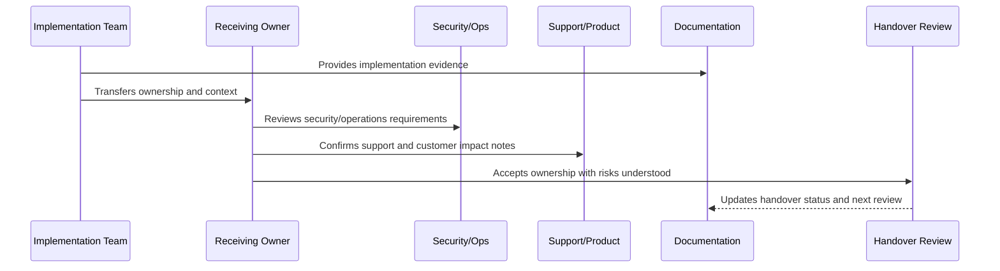

# Testing and Quality Handover

> *"Defines testing/quality handover for test suites, fixtures, CI gates, security tests, performance tests, AI tests, release regression, coverage policy, and ownership."*

---

# Purpose

Defines testing/quality handover for test suites, fixtures, CI gates, security tests, performance tests, AI tests, release regression, coverage policy, and ownership.

---

# Handover Problem

Tests lose value when future teams do not know what they protect or how to maintain them.

---

# Handover Decision

## Decision

CLARA testing handover should explain what quality gates protect, how to run tests, how to update fixtures, and how to extend test coverage safely.

## Status

Accepted.

---

# Implementation Handover Rule

Every CLARA implementation area should be handed over with:

```text
owner
backup owner
scope
architecture/design reference
security reference
operations reference
tests and quality gates
CI/CD or release path
known risks
open hardening items
support/runbook links
acceptance evidence
next review date
```

A handover is not complete if it cannot answer:

```text
who owns this area now
where the code lives
how to run and test it
how to deploy it
how to observe it
how to recover it
how to secure it
what risks remain
what docs/runbooks explain it
what evidence proves readiness
```

---

# Recommended Handover Flow



---

# Production-Ready Checklist

- [ ] Owner and backup owner are assigned.
- [ ] Code location is documented.
- [ ] Scope and boundaries are clear.
- [ ] Security notes are included.
- [ ] Tests and quality gates are documented.
- [ ] Deployment path is clear.
- [ ] Observability/dashboard links are included.
- [ ] Runbooks/support docs are linked.
- [ ] Known risks are documented.
- [ ] Open hardening items are linked.
- [ ] Receiving owner accepts responsibility.

---

# Acceptance Criteria

- [ ] Handover is actionable.
- [ ] Future maintainers can find the right docs.
- [ ] Security and operational responsibilities are clear.
- [ ] Risks are visible.
- [ ] Evidence is preserved.
- [ ] Next step toward master index is clear.
- [ ] AI coding assistants can apply this safely.

---

# Anti-patterns

Avoid:

- “Ask the original developer” as the handover plan.
- No backup owner.
- No test command documentation.
- No deployment/rollback explanation.
- No known risk list.
- No support escalation path.
- No security notes.
- No dashboard/runbook links.
- No hardening backlog.
- Handover accepted without evidence.

---

# Related Documents

- ../PART-01-Implementation-Foundation/README.md
- ../PART-02-Repository-and-Module-Implementation/README.md
- ../PART-09-CI-CD-and-Environment-Implementation/README.md
- ../PART-10-Production-Launch-Plan/README.md
- ../PART-11-Production-Validation-and-Hardening/README.md
- ../../BOOK-07-Operations-Observability-and-Reliability/BOOK-07-Master-Index/README.md
- ../../BOOK-06-Security-Governance-and-Compliance/BOOK-06-Master-Index/README.md

---

# Navigation

**Previous:** `139-Integration-and-Webhook-Handover.md`

**Next:** `141-CI-CD-and-Environment-Handover.md`

---

# Testing Handover Items

Include:

```text
unit test commands
integration test commands
contract test commands
e2e test commands
security test commands
performance test commands
AI quality test commands
fixtures location
mock/provider stubs
CI gate mapping
coverage policy
release regression checklist
```

---

# Quality Evidence

Collect:

```text
latest CI results
test coverage summary
critical workflow test list
security scan result
migration test result
AI quality regression result
known flaky tests
test maintenance owner
```

---

# Testing Handover Rule

A test suite with no owner will eventually become noise.
