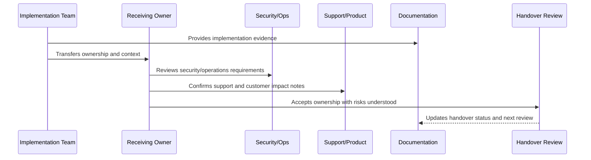

# CI/CD and Environment Handover

> *"Defines CI/CD and environment handover for pipelines, environments, secrets, artifacts, promotions, migrations, feature flags, deployment strategies, rollback, hotfix, and audit evidence."*

---

# Purpose

Defines CI/CD and environment handover for pipelines, environments, secrets, artifacts, promotions, migrations, feature flags, deployment strategies, rollback, hotfix, and audit evidence.

---

# Handover Problem

CI/CD is production control-plane infrastructure; unclear handover can create outages or security incidents.

---

# Handover Decision

## Decision

CLARA CI/CD handover should ensure future owners understand deployment controls, environment boundaries, secret injection, rollback paths, and pipeline security.

## Status

Accepted.

---

# Implementation Handover Rule

Every CLARA implementation area should be handed over with:

```text
owner
backup owner
scope
architecture/design reference
security reference
operations reference
tests and quality gates
CI/CD or release path
known risks
open hardening items
support/runbook links
acceptance evidence
next review date
```

A handover is not complete if it cannot answer:

```text
who owns this area now
where the code lives
how to run and test it
how to deploy it
how to observe it
how to recover it
how to secure it
what risks remain
what docs/runbooks explain it
what evidence proves readiness
```

---

# Recommended Handover Flow



---

# Production-Ready Checklist

- [ ] Owner and backup owner are assigned.
- [ ] Code location is documented.
- [ ] Scope and boundaries are clear.
- [ ] Security notes are included.
- [ ] Tests and quality gates are documented.
- [ ] Deployment path is clear.
- [ ] Observability/dashboard links are included.
- [ ] Runbooks/support docs are linked.
- [ ] Known risks are documented.
- [ ] Open hardening items are linked.
- [ ] Receiving owner accepts responsibility.

---

# Acceptance Criteria

- [ ] Handover is actionable.
- [ ] Future maintainers can find the right docs.
- [ ] Security and operational responsibilities are clear.
- [ ] Risks are visible.
- [ ] Evidence is preserved.
- [ ] Next step toward master index is clear.
- [ ] AI coding assistants can apply this safely.

---

# Anti-patterns

Avoid:

- “Ask the original developer” as the handover plan.
- No backup owner.
- No test command documentation.
- No deployment/rollback explanation.
- No known risk list.
- No support escalation path.
- No security notes.
- No dashboard/runbook links.
- No hardening backlog.
- Handover accepted without evidence.

---

# Related Documents

- ../PART-01-Implementation-Foundation/README.md
- ../PART-02-Repository-and-Module-Implementation/README.md
- ../PART-09-CI-CD-and-Environment-Implementation/README.md
- ../PART-10-Production-Launch-Plan/README.md
- ../PART-11-Production-Validation-and-Hardening/README.md
- ../../BOOK-07-Operations-Observability-and-Reliability/BOOK-07-Master-Index/README.md
- ../../BOOK-06-Security-Governance-and-Compliance/BOOK-06-Master-Index/README.md

---

# Navigation

**Previous:** `140-Testing-and-Quality-Handover.md`

**Next:** `142-Launch-and-Hardening-Handover.md`

---

# CI/CD Handover Items

Include:

```text
branch protection rules
pipeline stages
required quality gates
artifact/image strategy
environment promotion flow
secret injection model
migration deployment flow
feature flag ownership
deployment strategy
rollback/hotfix workflow
pipeline security controls
audit evidence location
```

---

# Environment Handover Items

Include:

```text
environment list
environment owners
config inventory
secret ownership
database/storage/queue boundaries
observability labels
deployment permissions
access review cadence
```

---

# CI/CD Handover Rule

CI/CD ownership includes security responsibility because pipelines can change production.
