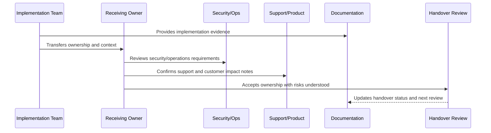

# Book VIII Closure

> *"Closes Book VIII by summarizing implementation, delivery, production launch, validation, and handover responsibilities."*

---

# Purpose

Closes Book VIII by summarizing implementation, delivery, production launch, validation, and handover responsibilities.

---

# Handover Problem

A book-level closure ensures the implementation phase has a clear ending point and a clean bridge to the next phase.

---

# Handover Decision

## Decision

Book VIII should be considered complete when implementation guidance, launch planning, production validation, hardening, and ownership transfer are documented and ready for the master index.

## Status

Accepted.

---

# Implementation Handover Rule

Every CLARA implementation area should be handed over with:

```text
owner
backup owner
scope
architecture/design reference
security reference
operations reference
tests and quality gates
CI/CD or release path
known risks
open hardening items
support/runbook links
acceptance evidence
next review date
```

A handover is not complete if it cannot answer:

```text
who owns this area now
where the code lives
how to run and test it
how to deploy it
how to observe it
how to recover it
how to secure it
what risks remain
what docs/runbooks explain it
what evidence proves readiness
```

---

# Recommended Handover Flow



---

# Production-Ready Checklist

- [ ] Owner and backup owner are assigned.
- [ ] Code location is documented.
- [ ] Scope and boundaries are clear.
- [ ] Security notes are included.
- [ ] Tests and quality gates are documented.
- [ ] Deployment path is clear.
- [ ] Observability/dashboard links are included.
- [ ] Runbooks/support docs are linked.
- [ ] Known risks are documented.
- [ ] Open hardening items are linked.
- [ ] Receiving owner accepts responsibility.

---

# Acceptance Criteria

- [ ] Handover is actionable.
- [ ] Future maintainers can find the right docs.
- [ ] Security and operational responsibilities are clear.
- [ ] Risks are visible.
- [ ] Evidence is preserved.
- [ ] Next step toward master index is clear.
- [ ] AI coding assistants can apply this safely.

---

# Anti-patterns

Avoid:

- “Ask the original developer” as the handover plan.
- No backup owner.
- No test command documentation.
- No deployment/rollback explanation.
- No known risk list.
- No support escalation path.
- No security notes.
- No dashboard/runbook links.
- No hardening backlog.
- Handover accepted without evidence.

---

# Related Documents

- ../PART-01-Implementation-Foundation/README.md
- ../PART-02-Repository-and-Module-Implementation/README.md
- ../PART-09-CI-CD-and-Environment-Implementation/README.md
- ../PART-10-Production-Launch-Plan/README.md
- ../PART-11-Production-Validation-and-Hardening/README.md
- ../../BOOK-07-Operations-Observability-and-Reliability/BOOK-07-Master-Index/README.md
- ../../BOOK-06-Security-Governance-and-Compliance/BOOK-06-Master-Index/README.md

---

# Navigation

**Previous:** `142-Launch-and-Hardening-Handover.md`

**Next:** `144-Part-12-Summary.md`

---

# Book VIII Completion Criteria

Book VIII is complete when:

```text
implementation foundation is documented
repository/module model is documented
backend implementation is documented
frontend/client implementation is documented
database/migration implementation is documented
AI/automation implementation is documented
integration/webhook implementation is documented
testing/quality implementation is documented
CI/CD/environment implementation is documented
production launch plan is documented
production validation/hardening is documented
handover is documented
master index is ready to be created
```

---

# Book VIII Outcome

Book VIII transforms CLARA from documented architecture and operations into:

```text
implementation-ready repository plan
production-ready engineering standards
secure coding and delivery flow
quality gates
controlled launch process
post-launch hardening process
ownership transfer model
```

---

# Closure Rule

Book VIII closes the implementation and launch planning phase, but it does not end continuous improvement.
