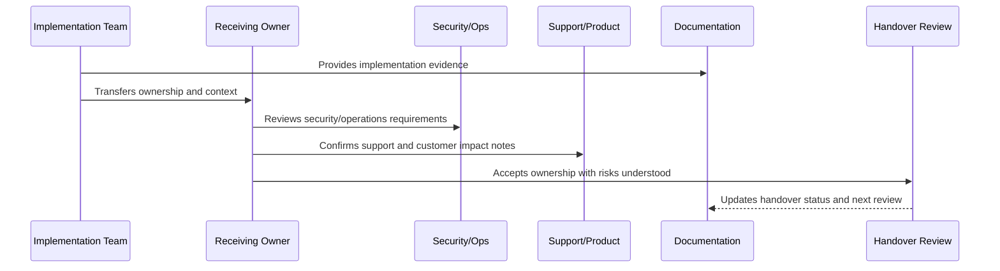

# Part 12 Summary

> *"Summarizes Implementation Handover and Master Index and recommends the final Book VIII Master Index artifact."*

---

# Purpose

Summarizes Implementation Handover and Master Index and recommends the final Book VIII Master Index artifact.

---

# Handover Problem

The master index is needed because Book VIII now contains 144 chapters across implementation, delivery, launch, validation, and handover.

---

# Handover Decision

## Decision

CLARA should create the BOOK-08 Master Index after completing Part 12 so all Book VIII parts, chapters, maps, implementation dependencies, and next steps are searchable from one place.

## Status

Accepted.

---

# Implementation Handover Rule

Every CLARA implementation area should be handed over with:

```text
owner
backup owner
scope
architecture/design reference
security reference
operations reference
tests and quality gates
CI/CD or release path
known risks
open hardening items
support/runbook links
acceptance evidence
next review date
```

A handover is not complete if it cannot answer:

```text
who owns this area now
where the code lives
how to run and test it
how to deploy it
how to observe it
how to recover it
how to secure it
what risks remain
what docs/runbooks explain it
what evidence proves readiness
```

---

# Recommended Handover Flow



---

# Production-Ready Checklist

- [ ] Owner and backup owner are assigned.
- [ ] Code location is documented.
- [ ] Scope and boundaries are clear.
- [ ] Security notes are included.
- [ ] Tests and quality gates are documented.
- [ ] Deployment path is clear.
- [ ] Observability/dashboard links are included.
- [ ] Runbooks/support docs are linked.
- [ ] Known risks are documented.
- [ ] Open hardening items are linked.
- [ ] Receiving owner accepts responsibility.

---

# Acceptance Criteria

- [ ] Handover is actionable.
- [ ] Future maintainers can find the right docs.
- [ ] Security and operational responsibilities are clear.
- [ ] Risks are visible.
- [ ] Evidence is preserved.
- [ ] Next step toward master index is clear.
- [ ] AI coding assistants can apply this safely.

---

# Anti-patterns

Avoid:

- “Ask the original developer” as the handover plan.
- No backup owner.
- No test command documentation.
- No deployment/rollback explanation.
- No known risk list.
- No support escalation path.
- No security notes.
- No dashboard/runbook links.
- No hardening backlog.
- Handover accepted without evidence.

---

# Related Documents

- ../PART-01-Implementation-Foundation/README.md
- ../PART-02-Repository-and-Module-Implementation/README.md
- ../PART-09-CI-CD-and-Environment-Implementation/README.md
- ../PART-10-Production-Launch-Plan/README.md
- ../PART-11-Production-Validation-and-Hardening/README.md
- ../../BOOK-07-Operations-Observability-and-Reliability/BOOK-07-Master-Index/README.md
- ../../BOOK-06-Security-Governance-and-Compliance/BOOK-06-Master-Index/README.md

---

# Navigation

**Previous:** `143-Book-VIII-Closure.md`

**Next:** `../BOOK-08-Master-Index/README.md`

---

# Part 12 Completion

Part 12 establishes:

- Implementation handover overview.
- Repository and module handover.
- Backend implementation handover.
- Frontend/client implementation handover.
- Database and migration handover.
- AI and automation handover.
- Integration and webhook handover.
- Testing and quality handover.
- CI/CD and environment handover.
- Launch and hardening handover.
- Book VIII closure.
- Part 12 summary.

---

# Final Book VIII Artifact Needed

Create:

```text
BOOK-08 Master Index
```

It should include:

```text
all Book VIII parts
all chapters 01–144
implementation dependency map
repository/module map
backend/frontend/database map
AI/automation/integration map
testing/quality map
CI/CD/launch map
handover map
next steps toward Book IX
```

---

# Recommended Next Book

After the BOOK-08 Master Index, the recommended next book is:

```text
BOOK IX — Product Operations, Growth & Continuous Improvement
```

Recommended parts:

```text
PART-01 Product Operations Foundation
PART-02 Customer Onboarding and Success
PART-03 Support Operations and Knowledge Loop
PART-04 Growth Experiments and Activation
PART-05 Billing Packaging and Monetization Operations
PART-06 Analytics and Product Insights
PART-07 Feedback Prioritization and Roadmap Operations
PART-08 Continuous Security and Compliance Operations
PART-09 Continuous Reliability and Performance Improvement
PART-10 AI Quality and Automation Improvement
PART-11 Business Review and Operating Cadence
PART-12 Product Operations Handover and Master Index
```
