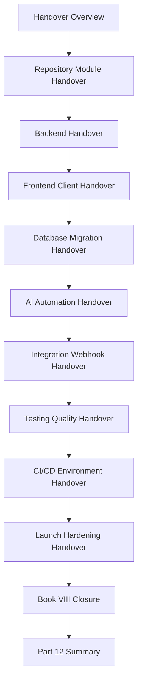

# PART-12 — Implementation Handover and Master Index

> *"Implementation is complete only when another qualified team can safely maintain, operate, secure, and evolve what was built."*

---

# Purpose

Part 12 defines CLARA's implementation handover and Book VIII closure standards.

It covers:

- Implementation Handover and Master Index overview.
- Repository and Module Handover.
- Backend Implementation Handover.
- Frontend and Client Implementation Handover.
- Database and Migration Handover.
- AI and Automation Handover.
- Integration and Webhook Handover.
- Testing and Quality Handover.
- CI/CD and Environment Handover.
- Launch and Hardening Handover.
- Book VIII Closure.
- Part 12 Summary.

---

# Chapter Map

| Chapter | Title |
|---:|---|
| 133 | Implementation Handover and Master Index Overview |
| 134 | Repository and Module Handover |
| 135 | Backend Implementation Handover |
| 136 | Frontend and Client Implementation Handover |
| 137 | Database and Migration Handover |
| 138 | AI and Automation Handover |
| 139 | Integration and Webhook Handover |
| 140 | Testing and Quality Handover |
| 141 | CI/CD and Environment Handover |
| 142 | Launch and Hardening Handover |
| 143 | Book VIII Closure |
| 144 | Part 12 Summary |

---

# Implementation Handover Map



---

# Handover Non-Negotiables

CLARA implementation handover must include:

```text
owners and backup owners
repository/module map
backend ownership and boundaries
frontend/client workflow ownership
database/migration ownership
AI/automation safety ownership
integration/webhook ownership
testing/quality ownership
CI/CD/environment ownership
launch evidence
hardening roadmap
known risks
runbooks and operational links
security notes
support notes
next-step recommendations
```

---

# Relationship to Previous Parts

Parts 01–11 define implementation, quality, CI/CD, launch, validation, and hardening.

Part 12 transfers that knowledge into long-term ownership and prepares the Book VIII Master Index.

---

# Navigation

**Previous:** `../PART-11-Production-Validation-and-Hardening/132-Part-11-Summary.md`

**Next:** `133-Implementation-Handover-and-Master-Index-Overview.md`
