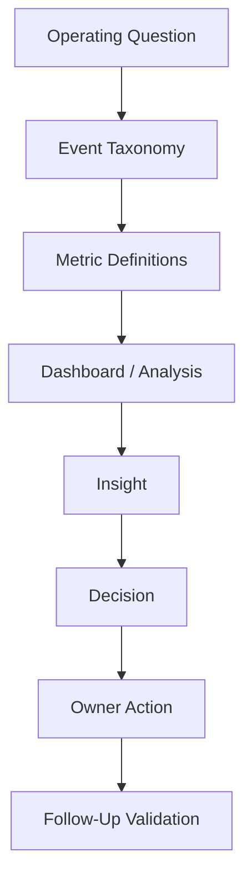
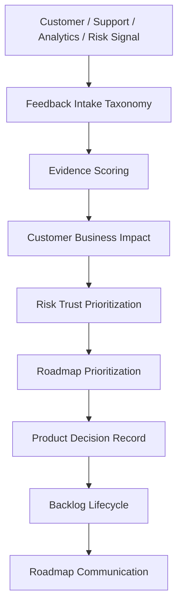

# BOOK-09 Analytics and Roadmap Map

> *"Analytics becomes valuable only when it changes decisions. Feedback becomes valuable only when it changes roadmap or knowledge."*

---

# Purpose

This document maps analytics, product insights, feedback prioritization, and roadmap operations.

---

# Primary Sources

```text
PART-06 — Analytics and Product Insights
PART-07 — Feedback Prioritization and Roadmap Operations
```

---

# Analytics to Decision Flow



---

# Feedback to Roadmap Flow



---

# Analytics Topics

```text
event taxonomy
metric definitions
metric governance
dashboard strategy
funnel analysis
retention analysis
customer health analytics
support/product quality analytics
AI analytics
revenue analytics
insight-to-decision workflow
```

---

# Roadmap Topics

```text
feedback intake taxonomy
evidence scoring
prioritization framework
customer/business impact scoring
risk/trust prioritization
planning cadence
product decision records
backlog hygiene
roadmap communication
```

---

# Non-Negotiables

```text
events must have purpose and owner
metrics need definitions
dashboards need audience and decision use
feedback must be captured in a system
risk/trust work must be prioritizable
backlog needs lifecycle states
roadmap communication must avoid accidental promises
```
