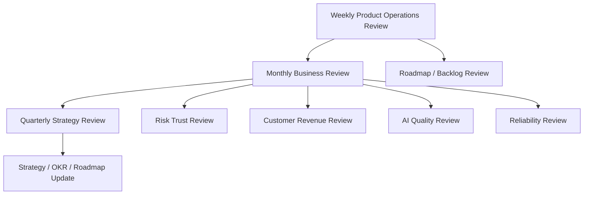
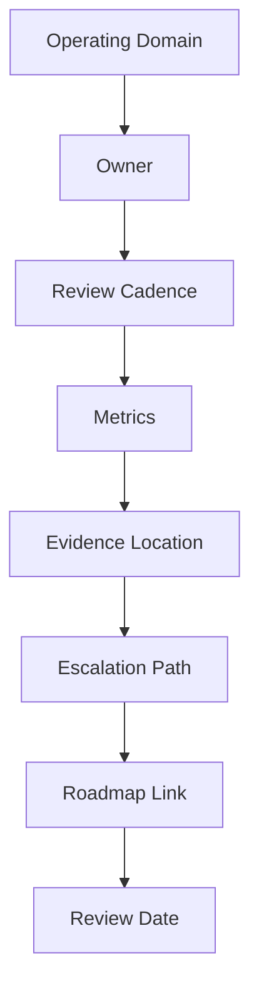

# BOOK-09 Business Cadence and Handover Map

> *"Operating cadence turns product signals into business decisions. Handover turns documentation into durable ownership."*

---

# Purpose

This document maps business review cadence and product operations handover.

---

# Primary Sources

```text
PART-11 — Business Review and Operating Cadence
PART-12 — Product Operations Handover and Master Index
```

---

# Business Cadence Flow



---

# Handover Flow



---

# Business Cadence Topics

```text
weekly product operations review
monthly business review
quarterly strategy review
KPI and OKR review
cross-functional rhythm
risk and trust review
customer and revenue review
decision and action tracking
leadership reporting
```

---

# Handover Topics

```text
product operations readiness
customer operations handover
support and knowledge loop handover
growth and monetization handover
analytics and roadmap handover
security and reliability handover
AI quality handover
business cadence handover
Book IX closure
```

---

# Non-Negotiables

```text
no meeting without decision/action
owners required
action items need deadline and success criteria
risk must be visible
leadership reports must be decision-oriented
handover requires owner, cadence, metric, evidence, escalation, roadmap link
```
