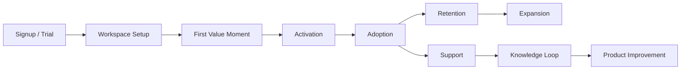
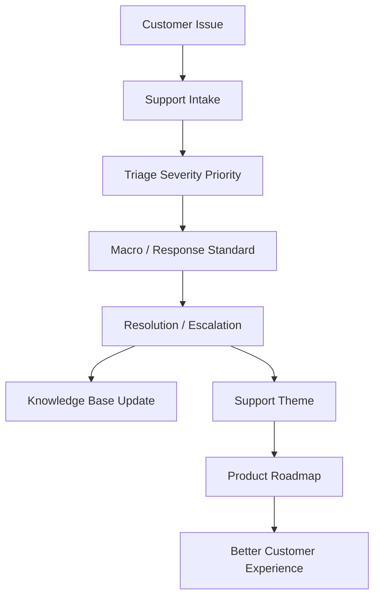

# BOOK-09 Customer and Support Map

> *"Customer success and support are not separate from product. They are the earliest warning system for product value and product friction."*

---

# Purpose

This document maps customer onboarding, success, support operations, and knowledge loop.

---

# Primary Sources

```text
PART-02 — Customer Onboarding and Success
PART-03 — Support Operations and Knowledge Loop
```

---

# Customer Lifecycle Flow



---

# Support Knowledge Loop



---

# Customer Operations Topics

```text
account/workspace setup
first value moment
activation checklist
customer success playbooks
trial-to-paid lifecycle
customer health scoring
onboarding support workflow
product education
onboarding metrics
```

---

# Support Operations Topics

```text
support intake
triage
severity/priority
macros
response standards
knowledge base lifecycle
known issue management
engineering/product/security escalation
support analytics
customer communication
support-to-roadmap feedback
```

---

# Non-Negotiables

```text
signup is not activation
first value must be measurable
customer health should trigger action
support should never ask for secrets
known issues need owner/status/workaround
repeated support pain must feed product improvement
customer communication must be timely and factual
```
