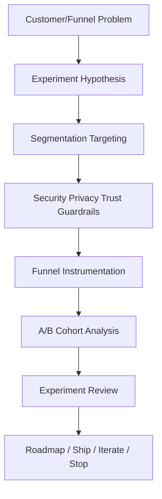
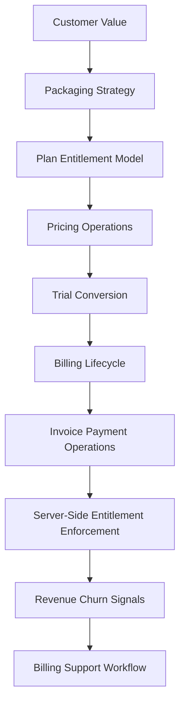

# BOOK-09 Growth Monetization Map

> *"Healthy growth means more customers reaching real value safely. Healthy monetization means customers clearly understand what they pay for."*

---

# Purpose

This document maps growth experiments, activation, billing, packaging, and monetization operations.

---

# Primary Sources

```text
PART-04 — Growth Experiments and Activation
PART-05 — Billing Packaging and Monetization Operations
```

---

# Growth Experiment Flow



---

# Monetization Operations Flow



---

# Growth Topics

```text
activation model
experiment hypothesis
segmentation
experiment guardrails
funnel instrumentation
A/B and cohort analysis
experiment review
growth risk management
experiment-to-roadmap loop
```

---

# Monetization Topics

```text
packaging strategy
plan and entitlement model
pricing operations
trial and conversion
billing lifecycle
invoice and payment operations
server-side entitlement enforcement
revenue and churn signals
billing support workflow
```

---

# Non-Negotiables

```text
no dark patterns
no misleading trial behavior
no frontend-only entitlement enforcement
no hidden fees
growth experiments require guardrails
pricing changes require review
billing communication must be clear
revenue metrics must connect to customer value
```
