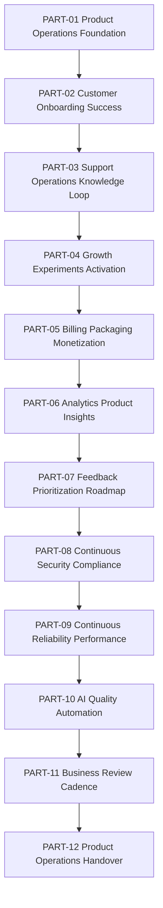

# BOOK-09 Master Index

> *"Book IX turns CLARA from a launched product into a continuously improving product organization."*

---

# Document Identity

```text
Book: BOOK IX
Title: Product Operations, Growth & Continuous Improvement
Status: Complete
Total Parts: 12
Total Chapters: 144
Purpose: Product operations after launch
Next Artifact: CLARA Master Documentation Index
```

---

# What Book IX Answers

Book IX answers:

```text
How does CLARA operate after launch?
How does CLARA onboard customers?
How does support become product learning?
How does growth stay ethical and measurable?
How does monetization stay clear and trustworthy?
How does analytics turn into decisions?
How does roadmap prioritization stay evidence-based?
How do security, compliance, reliability, and AI quality keep improving?
How does leadership review the business?
How does the operating model get handed over?
```

---

# Full Part Map

| Part | Title | Folder | Chapters |
|---|---|---|---:|
| PART-01 | Product Operations Foundation | `PART-01-Product-Operations-Foundation/` | 1–12 |
| PART-02 | Customer Onboarding and Success | `PART-02-Customer-Onboarding-and-Success/` | 13–24 |
| PART-03 | Support Operations and Knowledge Loop | `PART-03-Support-Operations-and-Knowledge-Loop/` | 25–36 |
| PART-04 | Growth Experiments and Activation | `PART-04-Growth-Experiments-and-Activation/` | 37–48 |
| PART-05 | Billing Packaging and Monetization Operations | `PART-05-Billing-Packaging-and-Monetization-Operations/` | 49–60 |
| PART-06 | Analytics and Product Insights | `PART-06-Analytics-and-Product-Insights/` | 61–72 |
| PART-07 | Feedback Prioritization and Roadmap Operations | `PART-07-Feedback-Prioritization-and-Roadmap-Operations/` | 73–84 |
| PART-08 | Continuous Security and Compliance Operations | `PART-08-Continuous-Security-and-Compliance-Operations/` | 85–96 |
| PART-09 | Continuous Reliability and Performance Improvement | `PART-09-Continuous-Reliability-and-Performance-Improvement/` | 97–108 |
| PART-10 | AI Quality and Automation Improvement | `PART-10-AI-Quality-and-Automation-Improvement/` | 109–120 |
| PART-11 | Business Review and Operating Cadence | `PART-11-Business-Review-and-Operating-Cadence/` | 121–132 |
| PART-12 | Product Operations Handover and Master Index | `PART-12-Product-Operations-Handover-and-Master-Index/` | 133–144 |

---

# Master Product Operations Flow



---

# Core Operating Principle

```text
Every product signal should become one of:
- customer success action
- support knowledge update
- roadmap decision
- growth experiment
- security/reliability improvement
- AI quality improvement
- business review action
- documented decision to defer/reject
```

---

# Product Operations Source of Truth Priority

When operating CLARA after launch, prioritize:

```text
1. Customer trust and safety
2. Security/privacy/compliance obligations
3. Critical customer workflows
4. Product value and retention
5. Revenue sustainability
6. Growth experiments
7. Internal efficiency
```

---

# AI Coding Assistant Routing

When using an AI coding assistant:

```text
Customer onboarding changes -> PART-02
Support/knowledge changes   -> PART-03
Growth experiment changes   -> PART-04
Billing/entitlement changes -> PART-05
Analytics/event changes     -> PART-06
Roadmap/backlog changes     -> PART-07
Security/compliance changes -> PART-08
Reliability/perf changes    -> PART-09
AI/automation changes       -> PART-10
Business cadence docs       -> PART-11
Handover docs               -> PART-12
```

---

# Book IX Completion Statement

```text
BOOK IX is complete.

CLARA now has a documented post-launch product operations system that covers:
customer lifecycle, support learning, growth, monetization, analytics, roadmap, continuous trust, reliability, AI quality, business cadence, and handover.
```
