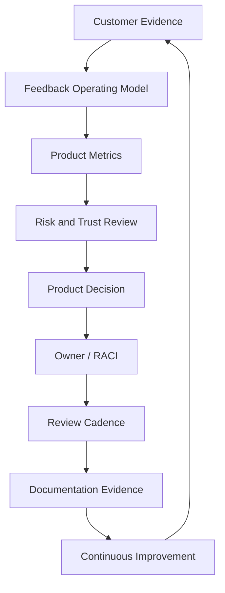

# BOOK-09 Product Operations Map

> *"Product operations is the system that keeps customer value, product decisions, and trust aligned after launch."*

---

# Purpose

This document maps Book IX's core product operations foundation.

---

# Primary Source

```text
PART-01 — Product Operations Foundation
```

---

# Foundation Chapters

```text
01 Product Operations Overview
02 Product Operations Principles
03 Customer Lifecycle Model
04 Product Metrics Operating Model
05 Product Feedback Operating Model
06 Product Experimentation Principles
07 Product Risk and Trust Model
08 Product Operations Roles and RACI
09 Product Review Cadence
10 Product Documentation and Evidence
11 Product Operations Anti-Patterns
12 Part 01 Summary
```

---

# Product Operations Model



---

# Non-Negotiables

```text
customer evidence over opinion
trust before growth
metrics tied to customer value
owner for every decision
feedback captured from all sources
experiments with guardrails
support signals included
security and reliability as product inputs
decision evidence preserved
```

---

# When to Use This Map

Use this map for:

```text
product operating model design
product ops owner onboarding
review cadence setup
feedback process design
RACI and ownership clarification
product evidence/decision standards
```

---

# Related Parts

```text
PART-06 Analytics and Product Insights
PART-07 Feedback Prioritization and Roadmap Operations
PART-11 Business Review and Operating Cadence
PART-12 Product Operations Handover and Master Index
```
