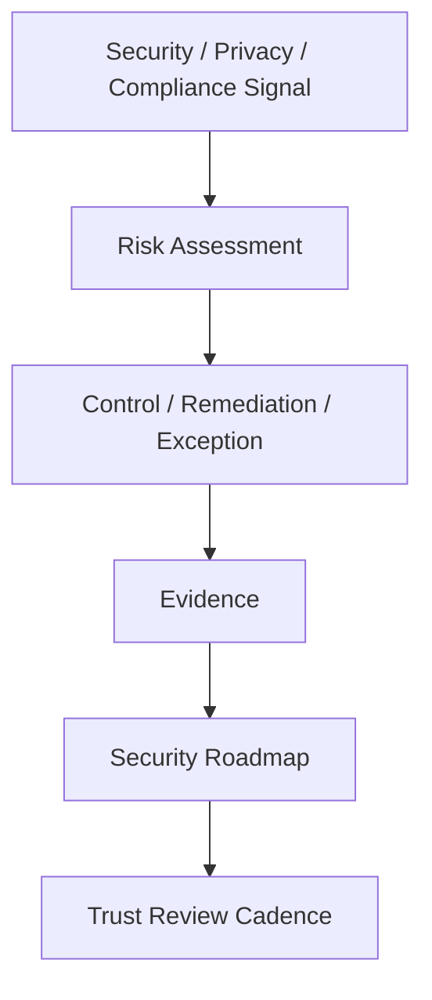
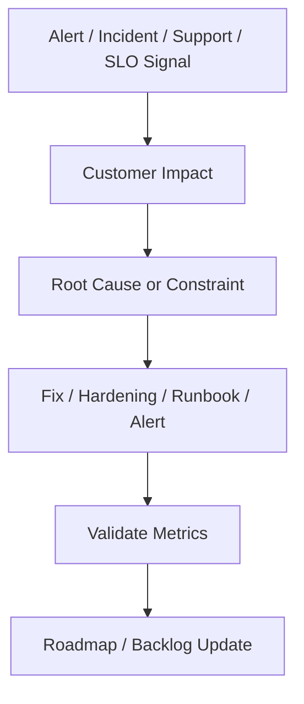
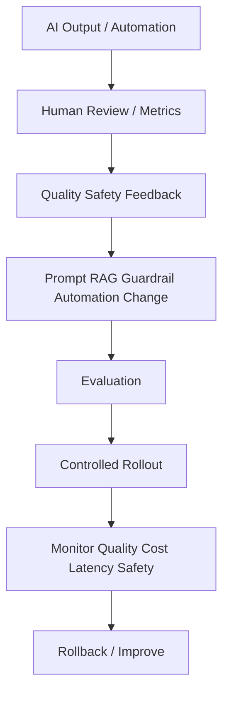

# BOOK-09 Trust Reliability AI Map

> *"Trust is continuous. Reliability is continuous. AI quality is continuous."*

---

# Purpose

This document maps continuous security, compliance, reliability, performance, AI quality, and automation improvement.

---

# Primary Sources

```text
PART-08 — Continuous Security and Compliance Operations
PART-09 — Continuous Reliability and Performance Improvement
PART-10 — AI Quality and Automation Improvement
```

---

# Continuous Trust Flow



---

# Reliability Improvement Flow



---

# AI Quality Improvement Flow



---

# Trust Topics

```text
security feedback loop
access review
vulnerability and patch cadence
privacy and data handling
compliance evidence
security customer communication
security roadmap
trust center content
security/compliance metrics
```

---

# Reliability Topics

```text
SLO and error budget review
performance cadence
capacity planning
incident-to-roadmap improvement
customer-impact reliability analytics
integration and AI reliability
communication standards
reliability/performance metrics
```

---

# AI Topics

```text
AI quality feedback
human review analytics
prompt/RAG lifecycle
AI safety guardrails
automation failure review
cost and latency optimization
AI explainability
AI incident rollback
AI metrics
```

---

# Non-Negotiables

```text
least privilege access
privacy review for data changes
evidence collected continuously
SLOs used in product decisions
incidents produce owned follow-up
AI changes versioned and reversible
high-impact automation needs rollback
AI quality measured beyond usage volume
```
