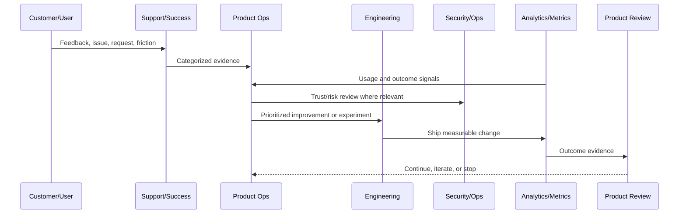

# Product Operations Overview

> *"Introduces CLARA's product operations model for continuously improving the product after launch using customer evidence, product metrics, support feedback, risk signals, and operating cadence."*

---

# Purpose

Introduces CLARA's product operations model for continuously improving the product after launch using customer evidence, product metrics, support feedback, risk signals, and operating cadence.

---

# Product Operations Problem

A product can be launched successfully but still fail to grow, retain users, or improve safely if product operations are unmanaged.

---

# Product Operations Decision

## Decision

CLARA should treat product operations as a disciplined system that connects customer lifecycle, metrics, feedback, experimentation, support, security, reliability, and business review.

## Status

Accepted.

---

# Product Operations Rule

Every CLARA product operations activity should connect:

```text
Customer Evidence -> Product Metric -> Risk/Trust Review -> Decision -> Owner -> Experiment/Improvement -> Validation -> Documentation
```

A product operations decision is not mature if it cannot answer:

```text
what customer problem it addresses
what evidence supports it
what metric should move
what trust/security/reliability risk exists
who owns the decision
how success will be measured
how failure will be detected
what documentation/evidence will be kept
```

---

# Recommended Product Operations Flow



---

# Production-Ready Checklist

- [ ] Customer evidence is captured.
- [ ] Product metric is defined.
- [ ] Security/trust impact is considered.
- [ ] Reliability/operations impact is considered.
- [ ] Owner is assigned.
- [ ] Success criteria are defined.
- [ ] Failure signal is defined.
- [ ] Documentation/evidence is stored.
- [ ] Follow-up cadence is scheduled.

---

# Acceptance Criteria

- [ ] Product operations decision-making is evidence-based.
- [ ] Feedback is not lost.
- [ ] Metrics are connected to customer outcomes.
- [ ] Risk and trust are included.
- [ ] Owners and cadence are clear.
- [ ] AI coding assistants can apply this safely.

---

# Anti-patterns

Avoid:

- Roadmap decisions based only on loudest customer.
- Vanity metrics without product outcome.
- Growth experiments without trust guardrails.
- Support tickets ignored by product.
- Security/reliability treated as engineering-only concerns.
- Feedback stored only in chat.
- Experiments with no hypothesis.
- Decisions with no owner.
- Metrics reviewed only after problems explode.

---

# Related Documents

- ../../BOOK-02-Product-and-Domain/
- ../../BOOK-05-Engineering-Execution-Plan/
- ../../BOOK-06-Security-Governance-and-Compliance/
- ../../BOOK-07-Operations-Observability-and-Reliability/
- ../../BOOK-08-Implementation-Delivery-and-Production-Launch/

---

# Navigation

**Previous:** `../BOOK-08-Implementation-Delivery-and-Production-Launch/BOOK-08-Master-Index/README.md`

**Next:** `02-Product-Operations-Principles.md`

---

# Product Operations Scope

Product operations covers:

```text
customer lifecycle
onboarding
activation
support feedback
product analytics
roadmap prioritization
experimentation
growth
billing/packaging operations
security and trust signals
reliability and performance signals
AI quality signals
business review cadence
```

---

# Product Operations Inputs

Use evidence from:

```text
product usage
customer feedback
support tickets
sales/customer success notes
incidents
security findings
AI review outcomes
integration failures
performance data
churn/retention data
billing data
```

---

# Guiding Question

```text
Are we improving the product in a way that increases customer value without weakening trust?
```
