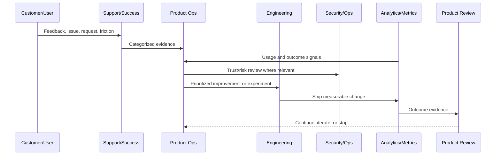

# Product Operations Principles

> *"Defines the principles that guide CLARA product operations after launch."*

---

# Purpose

Defines the principles that guide CLARA product operations after launch.

---

# Product Operations Problem

Without shared principles, product decisions become reactive, opinion-driven, and disconnected from customer trust.

---

# Product Operations Decision

## Decision

CLARA product operations should be customer-evidence-driven, security-aware, measurable, iterative, transparent, and accountable.

## Status

Accepted.

---

# Product Operations Rule

Every CLARA product operations activity should connect:

```text
Customer Evidence -> Product Metric -> Risk/Trust Review -> Decision -> Owner -> Experiment/Improvement -> Validation -> Documentation
```

A product operations decision is not mature if it cannot answer:

```text
what customer problem it addresses
what evidence supports it
what metric should move
what trust/security/reliability risk exists
who owns the decision
how success will be measured
how failure will be detected
what documentation/evidence will be kept
```

---

# Recommended Product Operations Flow



---

# Production-Ready Checklist

- [ ] Customer evidence is captured.
- [ ] Product metric is defined.
- [ ] Security/trust impact is considered.
- [ ] Reliability/operations impact is considered.
- [ ] Owner is assigned.
- [ ] Success criteria are defined.
- [ ] Failure signal is defined.
- [ ] Documentation/evidence is stored.
- [ ] Follow-up cadence is scheduled.

---

# Acceptance Criteria

- [ ] Product operations decision-making is evidence-based.
- [ ] Feedback is not lost.
- [ ] Metrics are connected to customer outcomes.
- [ ] Risk and trust are included.
- [ ] Owners and cadence are clear.
- [ ] AI coding assistants can apply this safely.

---

# Anti-patterns

Avoid:

- Roadmap decisions based only on loudest customer.
- Vanity metrics without product outcome.
- Growth experiments without trust guardrails.
- Support tickets ignored by product.
- Security/reliability treated as engineering-only concerns.
- Feedback stored only in chat.
- Experiments with no hypothesis.
- Decisions with no owner.
- Metrics reviewed only after problems explode.

---

# Related Documents

- ../../BOOK-02-Product-and-Domain/
- ../../BOOK-05-Engineering-Execution-Plan/
- ../../BOOK-06-Security-Governance-and-Compliance/
- ../../BOOK-07-Operations-Observability-and-Reliability/
- ../../BOOK-08-Implementation-Delivery-and-Production-Launch/

---

# Navigation

**Previous:** `01-Product-Operations-Overview.md`

**Next:** `03-Customer-Lifecycle-Model.md`

---

# Core Principles

CLARA product operations should follow:

```text
customer evidence over opinion
trust before growth
measurable outcomes
small reversible experiments
clear ownership
cross-functional decision-making
support feedback as product signal
security and reliability as product quality
continuous learning
documentation as memory
```

---

# Decision Principle

A product decision should include:

```text
customer problem
evidence
metric
risk
owner
expected outcome
review date
```

---

# Trade-Off Principle

When growth and trust conflict:

```text
trust wins by default
risk acceptance must be explicit
mitigation must be assigned
review date must be scheduled
```

---

# Principle Rule

Product operations should optimize for sustainable customer trust, not just short-term activation.
