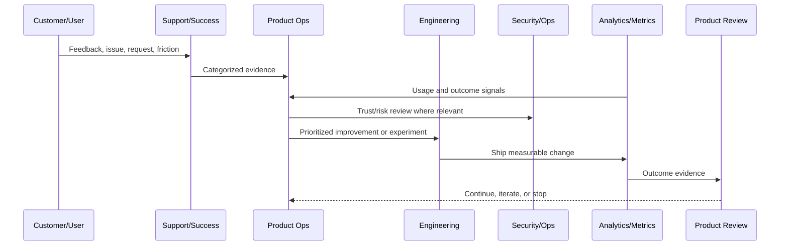
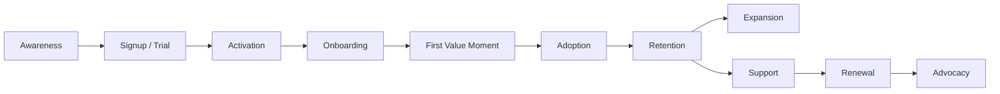

# Customer Lifecycle Model

> *"Defines CLARA's customer lifecycle from awareness to activation, onboarding, adoption, retention, expansion, support, renewal, and advocacy."*

---

# Purpose

Defines CLARA's customer lifecycle from awareness to activation, onboarding, adoption, retention, expansion, support, renewal, and advocacy.

---

# Product Operations Problem

Teams often optimize features without understanding where customers struggle in the lifecycle.

---

# Product Operations Decision

## Decision

CLARA should model product operations around the full customer lifecycle, not only feature delivery.

## Status

Accepted.

---

# Product Operations Rule

Every CLARA product operations activity should connect:

```text
Customer Evidence -> Product Metric -> Risk/Trust Review -> Decision -> Owner -> Experiment/Improvement -> Validation -> Documentation
```

A product operations decision is not mature if it cannot answer:

```text
what customer problem it addresses
what evidence supports it
what metric should move
what trust/security/reliability risk exists
who owns the decision
how success will be measured
how failure will be detected
what documentation/evidence will be kept
```

---

# Recommended Product Operations Flow



---

# Production-Ready Checklist

- [ ] Customer evidence is captured.
- [ ] Product metric is defined.
- [ ] Security/trust impact is considered.
- [ ] Reliability/operations impact is considered.
- [ ] Owner is assigned.
- [ ] Success criteria are defined.
- [ ] Failure signal is defined.
- [ ] Documentation/evidence is stored.
- [ ] Follow-up cadence is scheduled.

---

# Acceptance Criteria

- [ ] Product operations decision-making is evidence-based.
- [ ] Feedback is not lost.
- [ ] Metrics are connected to customer outcomes.
- [ ] Risk and trust are included.
- [ ] Owners and cadence are clear.
- [ ] AI coding assistants can apply this safely.

---

# Anti-patterns

Avoid:

- Roadmap decisions based only on loudest customer.
- Vanity metrics without product outcome.
- Growth experiments without trust guardrails.
- Support tickets ignored by product.
- Security/reliability treated as engineering-only concerns.
- Feedback stored only in chat.
- Experiments with no hypothesis.
- Decisions with no owner.
- Metrics reviewed only after problems explode.

---

# Related Documents

- ../../BOOK-02-Product-and-Domain/
- ../../BOOK-05-Engineering-Execution-Plan/
- ../../BOOK-06-Security-Governance-and-Compliance/
- ../../BOOK-07-Operations-Observability-and-Reliability/
- ../../BOOK-08-Implementation-Delivery-and-Production-Launch/

---

# Navigation

**Previous:** `02-Product-Operations-Principles.md`

**Next:** `04-Product-Metrics-Operating-Model.md`

---

# Customer Lifecycle Stages

CLARA lifecycle:

```text
awareness
signup/trial
activation
onboarding
first value moment
adoption
retention
expansion
support/resolution
renewal
advocacy
```

---

# Lifecycle Map



---

# Lifecycle Questions

For each stage, ask:

```text
what is the user trying to achieve
what friction exists
what metric proves progress
what support issues appear
what trust/security concerns exist
what product improvement would help
```

---

# Lifecycle Rule

Do not optimize one lifecycle stage while damaging another.
