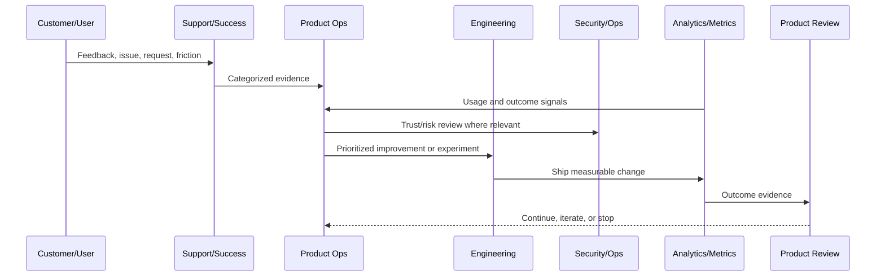
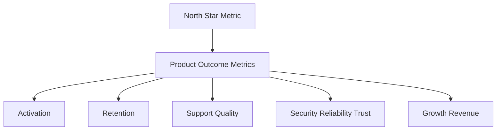

# Product Metrics Operating Model

> *"Defines product metrics, KPI hierarchy, activation metrics, retention metrics, quality metrics, support metrics, growth metrics, and trust metrics."*

---

# Purpose

Defines product metrics, KPI hierarchy, activation metrics, retention metrics, quality metrics, support metrics, growth metrics, and trust metrics.

---

# Product Operations Problem

Metrics become dangerous when teams optimize vanity numbers instead of customer value and trust.

---

# Product Operations Decision

## Decision

CLARA product metrics should connect product usage, customer value, operational health, security trust, and business outcomes.

## Status

Accepted.

---

# Product Operations Rule

Every CLARA product operations activity should connect:

```text
Customer Evidence -> Product Metric -> Risk/Trust Review -> Decision -> Owner -> Experiment/Improvement -> Validation -> Documentation
```

A product operations decision is not mature if it cannot answer:

```text
what customer problem it addresses
what evidence supports it
what metric should move
what trust/security/reliability risk exists
who owns the decision
how success will be measured
how failure will be detected
what documentation/evidence will be kept
```

---

# Recommended Product Operations Flow



---

# Production-Ready Checklist

- [ ] Customer evidence is captured.
- [ ] Product metric is defined.
- [ ] Security/trust impact is considered.
- [ ] Reliability/operations impact is considered.
- [ ] Owner is assigned.
- [ ] Success criteria are defined.
- [ ] Failure signal is defined.
- [ ] Documentation/evidence is stored.
- [ ] Follow-up cadence is scheduled.

---

# Acceptance Criteria

- [ ] Product operations decision-making is evidence-based.
- [ ] Feedback is not lost.
- [ ] Metrics are connected to customer outcomes.
- [ ] Risk and trust are included.
- [ ] Owners and cadence are clear.
- [ ] AI coding assistants can apply this safely.

---

# Anti-patterns

Avoid:

- Roadmap decisions based only on loudest customer.
- Vanity metrics without product outcome.
- Growth experiments without trust guardrails.
- Support tickets ignored by product.
- Security/reliability treated as engineering-only concerns.
- Feedback stored only in chat.
- Experiments with no hypothesis.
- Decisions with no owner.
- Metrics reviewed only after problems explode.

---

# Related Documents

- ../../BOOK-02-Product-and-Domain/
- ../../BOOK-05-Engineering-Execution-Plan/
- ../../BOOK-06-Security-Governance-and-Compliance/
- ../../BOOK-07-Operations-Observability-and-Reliability/
- ../../BOOK-08-Implementation-Delivery-and-Production-Launch/

---

# Navigation

**Previous:** `03-Customer-Lifecycle-Model.md`

**Next:** `05-Product-Feedback-Operating-Model.md`

---

# Metric Categories

Track:

```text
activation metrics
adoption metrics
retention metrics
engagement metrics
support metrics
quality metrics
reliability metrics
security/trust metrics
AI quality metrics
growth metrics
revenue/monetization metrics
```

---

# Metric Hierarchy



---

# Metric Quality Checklist

- [ ] Metric is tied to customer value.
- [ ] Metric can be measured consistently.
- [ ] Metric has an owner.
- [ ] Metric has a review cadence.
- [ ] Metric has guardrail metrics.
- [ ] Metric is not easily gamed.
- [ ] Metric can trigger action.

---

# Metrics Rule

Never optimize a product metric without reviewing guardrail metrics.
