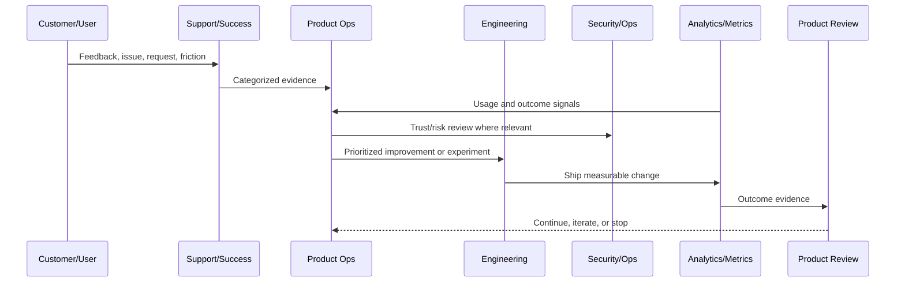
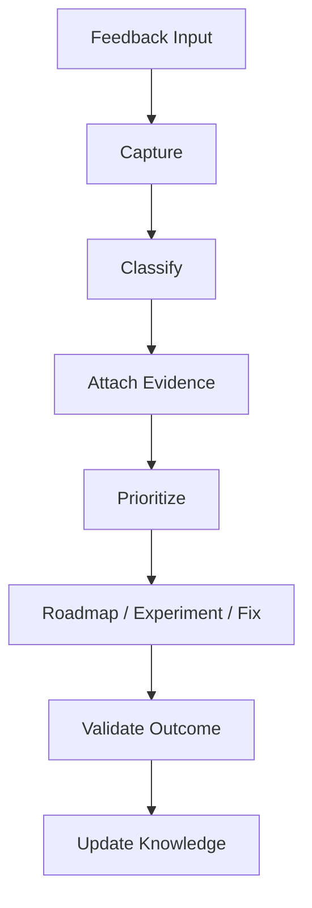

# Product Feedback Operating Model

> *"Defines how feedback from customers, support, sales, success, analytics, incidents, and AI review outcomes enters product operations."*

---

# Purpose

Defines how feedback from customers, support, sales, success, analytics, incidents, and AI review outcomes enters product operations.

---

# Product Operations Problem

Valuable feedback is lost when it stays scattered across chats, calls, tickets, and personal memory.

---

# Product Operations Decision

## Decision

CLARA feedback should be captured, categorized, prioritized, linked to evidence, and converted into roadmap or improvement work.

## Status

Accepted.

---

# Product Operations Rule

Every CLARA product operations activity should connect:

```text
Customer Evidence -> Product Metric -> Risk/Trust Review -> Decision -> Owner -> Experiment/Improvement -> Validation -> Documentation
```

A product operations decision is not mature if it cannot answer:

```text
what customer problem it addresses
what evidence supports it
what metric should move
what trust/security/reliability risk exists
who owns the decision
how success will be measured
how failure will be detected
what documentation/evidence will be kept
```

---

# Recommended Product Operations Flow



---

# Production-Ready Checklist

- [ ] Customer evidence is captured.
- [ ] Product metric is defined.
- [ ] Security/trust impact is considered.
- [ ] Reliability/operations impact is considered.
- [ ] Owner is assigned.
- [ ] Success criteria are defined.
- [ ] Failure signal is defined.
- [ ] Documentation/evidence is stored.
- [ ] Follow-up cadence is scheduled.

---

# Acceptance Criteria

- [ ] Product operations decision-making is evidence-based.
- [ ] Feedback is not lost.
- [ ] Metrics are connected to customer outcomes.
- [ ] Risk and trust are included.
- [ ] Owners and cadence are clear.
- [ ] AI coding assistants can apply this safely.

---

# Anti-patterns

Avoid:

- Roadmap decisions based only on loudest customer.
- Vanity metrics without product outcome.
- Growth experiments without trust guardrails.
- Support tickets ignored by product.
- Security/reliability treated as engineering-only concerns.
- Feedback stored only in chat.
- Experiments with no hypothesis.
- Decisions with no owner.
- Metrics reviewed only after problems explode.

---

# Related Documents

- ../../BOOK-02-Product-and-Domain/
- ../../BOOK-05-Engineering-Execution-Plan/
- ../../BOOK-06-Security-Governance-and-Compliance/
- ../../BOOK-07-Operations-Observability-and-Reliability/
- ../../BOOK-08-Implementation-Delivery-and-Production-Launch/

---

# Navigation

**Previous:** `04-Product-Metrics-Operating-Model.md`

**Next:** `06-Product-Experimentation-Principles.md`

---

# Feedback Sources

Capture feedback from:

```text
support tickets
customer interviews
sales/customer success notes
in-app feedback
usage analytics
churn reasons
incident reports
security reviews
AI review outcomes
integration failures
community messages
```

---

# Feedback Taxonomy

Categorize feedback as:

```text
bug
UX friction
missing feature
confusing workflow
performance issue
security/privacy concern
reliability issue
integration issue
AI quality issue
billing/pricing issue
documentation gap
support process issue
```

---

# Feedback Flow



---

# Feedback Rule

Feedback without classification, evidence, owner, and follow-up becomes noise.
