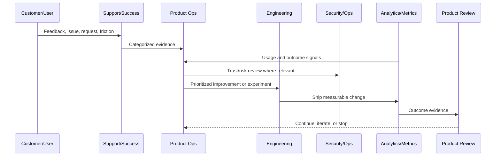

# Product Experimentation Principles

> *"Defines principles for running product experiments, growth tests, activation improvements, UX experiments, and AI/automation experiments safely."*

---

# Purpose

Defines principles for running product experiments, growth tests, activation improvements, UX experiments, and AI/automation experiments safely.

---

# Product Operations Problem

Experiments can harm customers when growth pressure overrides safety and product quality.

---

# Product Operations Decision

## Decision

CLARA experiments should be hypothesis-driven, measurable, reversible, privacy-aware, and guarded against security or trust regressions.

## Status

Accepted.

---

# Product Operations Rule

Every CLARA product operations activity should connect:

```text
Customer Evidence -> Product Metric -> Risk/Trust Review -> Decision -> Owner -> Experiment/Improvement -> Validation -> Documentation
```

A product operations decision is not mature if it cannot answer:

```text
what customer problem it addresses
what evidence supports it
what metric should move
what trust/security/reliability risk exists
who owns the decision
how success will be measured
how failure will be detected
what documentation/evidence will be kept
```

---

# Recommended Product Operations Flow



---

# Production-Ready Checklist

- [ ] Customer evidence is captured.
- [ ] Product metric is defined.
- [ ] Security/trust impact is considered.
- [ ] Reliability/operations impact is considered.
- [ ] Owner is assigned.
- [ ] Success criteria are defined.
- [ ] Failure signal is defined.
- [ ] Documentation/evidence is stored.
- [ ] Follow-up cadence is scheduled.

---

# Acceptance Criteria

- [ ] Product operations decision-making is evidence-based.
- [ ] Feedback is not lost.
- [ ] Metrics are connected to customer outcomes.
- [ ] Risk and trust are included.
- [ ] Owners and cadence are clear.
- [ ] AI coding assistants can apply this safely.

---

# Anti-patterns

Avoid:

- Roadmap decisions based only on loudest customer.
- Vanity metrics without product outcome.
- Growth experiments without trust guardrails.
- Support tickets ignored by product.
- Security/reliability treated as engineering-only concerns.
- Feedback stored only in chat.
- Experiments with no hypothesis.
- Decisions with no owner.
- Metrics reviewed only after problems explode.

---

# Related Documents

- ../../BOOK-02-Product-and-Domain/
- ../../BOOK-05-Engineering-Execution-Plan/
- ../../BOOK-06-Security-Governance-and-Compliance/
- ../../BOOK-07-Operations-Observability-and-Reliability/
- ../../BOOK-08-Implementation-Delivery-and-Production-Launch/

---

# Navigation

**Previous:** `05-Product-Feedback-Operating-Model.md`

**Next:** `07-Product-Risk-and-Trust-Model.md`

---

# Experiment Requirements

Every experiment should define:

```text
hypothesis
target user segment
expected behavior change
primary metric
guardrail metrics
risk assessment
duration
rollback/stop criteria
owner
review date
```

---

# Experiment Types

CLARA experiments may include:

```text
onboarding flow experiment
activation prompt experiment
support response experiment
pricing/packaging test
AI suggestion quality experiment
automation rule experiment
UI copy experiment
integration setup improvement
```

---

# Experiment Safety Rules

```text
do not expose sensitive data
do not weaken authorization
do not bypass security review
do not hide critical user choices
do not run irreversible experiments without explicit approval
do not automate high-impact actions without guardrails
```

---

# Experiment Rule

A product experiment should be reversible unless the risk is explicitly reviewed and accepted.
