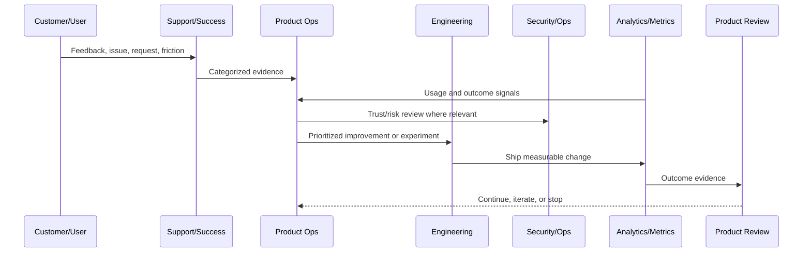

# Product Risk and Trust Model

> *"Defines product risk and trust model across security, privacy, reliability, AI safety, data correctness, user experience, and support expectations."*

---

# Purpose

Defines product risk and trust model across security, privacy, reliability, AI safety, data correctness, user experience, and support expectations.

---

# Product Operations Problem

A feature that improves conversion but weakens trust can damage the product long term.

---

# Product Operations Decision

## Decision

CLARA product operations should include risk and trust as first-class product decision inputs.

## Status

Accepted.

---

# Product Operations Rule

Every CLARA product operations activity should connect:

```text
Customer Evidence -> Product Metric -> Risk/Trust Review -> Decision -> Owner -> Experiment/Improvement -> Validation -> Documentation
```

A product operations decision is not mature if it cannot answer:

```text
what customer problem it addresses
what evidence supports it
what metric should move
what trust/security/reliability risk exists
who owns the decision
how success will be measured
how failure will be detected
what documentation/evidence will be kept
```

---

# Recommended Product Operations Flow



---

# Production-Ready Checklist

- [ ] Customer evidence is captured.
- [ ] Product metric is defined.
- [ ] Security/trust impact is considered.
- [ ] Reliability/operations impact is considered.
- [ ] Owner is assigned.
- [ ] Success criteria are defined.
- [ ] Failure signal is defined.
- [ ] Documentation/evidence is stored.
- [ ] Follow-up cadence is scheduled.

---

# Acceptance Criteria

- [ ] Product operations decision-making is evidence-based.
- [ ] Feedback is not lost.
- [ ] Metrics are connected to customer outcomes.
- [ ] Risk and trust are included.
- [ ] Owners and cadence are clear.
- [ ] AI coding assistants can apply this safely.

---

# Anti-patterns

Avoid:

- Roadmap decisions based only on loudest customer.
- Vanity metrics without product outcome.
- Growth experiments without trust guardrails.
- Support tickets ignored by product.
- Security/reliability treated as engineering-only concerns.
- Feedback stored only in chat.
- Experiments with no hypothesis.
- Decisions with no owner.
- Metrics reviewed only after problems explode.

---

# Related Documents

- ../../BOOK-02-Product-and-Domain/
- ../../BOOK-05-Engineering-Execution-Plan/
- ../../BOOK-06-Security-Governance-and-Compliance/
- ../../BOOK-07-Operations-Observability-and-Reliability/
- ../../BOOK-08-Implementation-Delivery-and-Production-Launch/

---

# Navigation

**Previous:** `06-Product-Experimentation-Principles.md`

**Next:** `08-Product-Operations-Roles-and-RACI.md`

---

# Trust Dimensions

CLARA product trust includes:

```text
security
privacy
reliability
data correctness
AI safety
explainability
support quality
billing clarity
integration reliability
performance
```

---

# Trust Review Questions

Before product changes:

```text
Could this expose customer data?
Could this confuse permissions?
Could this increase support burden?
Could this increase AI hallucination risk?
Could this break integrations?
Could this reduce reliability?
Could this mislead users?
Could this make billing unclear?
```

---

# Risk Levels

Use:

```text
low
medium
high
critical
```

Critical product risk requires explicit leadership/security approval.

---

# Trust Rule

A feature that increases short-term usage but reduces trust is not a healthy product improvement.
