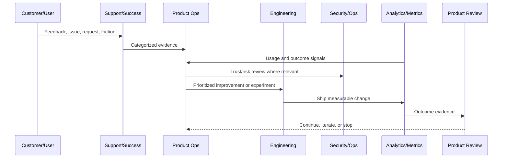

# Product Review Cadence

> *"Defines weekly, biweekly, monthly, quarterly, and incident-driven product review cadence."*

---

# Purpose

Defines weekly, biweekly, monthly, quarterly, and incident-driven product review cadence.

---

# Product Operations Problem

Without operating cadence, product decisions happen only when problems become urgent.

---

# Product Operations Decision

## Decision

CLARA should operate product reviews on a predictable cadence that uses evidence, metrics, risks, and customer feedback.

## Status

Accepted.

---

# Product Operations Rule

Every CLARA product operations activity should connect:

```text
Customer Evidence -> Product Metric -> Risk/Trust Review -> Decision -> Owner -> Experiment/Improvement -> Validation -> Documentation
```

A product operations decision is not mature if it cannot answer:

```text
what customer problem it addresses
what evidence supports it
what metric should move
what trust/security/reliability risk exists
who owns the decision
how success will be measured
how failure will be detected
what documentation/evidence will be kept
```

---

# Recommended Product Operations Flow



---

# Production-Ready Checklist

- [ ] Customer evidence is captured.
- [ ] Product metric is defined.
- [ ] Security/trust impact is considered.
- [ ] Reliability/operations impact is considered.
- [ ] Owner is assigned.
- [ ] Success criteria are defined.
- [ ] Failure signal is defined.
- [ ] Documentation/evidence is stored.
- [ ] Follow-up cadence is scheduled.

---

# Acceptance Criteria

- [ ] Product operations decision-making is evidence-based.
- [ ] Feedback is not lost.
- [ ] Metrics are connected to customer outcomes.
- [ ] Risk and trust are included.
- [ ] Owners and cadence are clear.
- [ ] AI coding assistants can apply this safely.

---

# Anti-patterns

Avoid:

- Roadmap decisions based only on loudest customer.
- Vanity metrics without product outcome.
- Growth experiments without trust guardrails.
- Support tickets ignored by product.
- Security/reliability treated as engineering-only concerns.
- Feedback stored only in chat.
- Experiments with no hypothesis.
- Decisions with no owner.
- Metrics reviewed only after problems explode.

---

# Related Documents

- ../../BOOK-02-Product-and-Domain/
- ../../BOOK-05-Engineering-Execution-Plan/
- ../../BOOK-06-Security-Governance-and-Compliance/
- ../../BOOK-07-Operations-Observability-and-Reliability/
- ../../BOOK-08-Implementation-Delivery-and-Production-Launch/

---

# Navigation

**Previous:** `08-Product-Operations-Roles-and-RACI.md`

**Next:** `10-Product-Documentation-and-Evidence.md`

---

# Review Cadence

Recommended cadence:

```text
daily launch/stabilization review when needed
weekly product operations review
biweekly roadmap/prioritization review
monthly business/product metrics review
monthly security/reliability product risk review
quarterly strategy review
post-incident product impact review
post-experiment review
```

---

# Weekly Product Ops Review Agenda

```text
metric changes
customer feedback themes
support escalations
incidents/defects
AI quality issues
integration issues
active experiments
roadmap decisions
risk review
action item follow-up
```

---

# Review Output

Each review should produce:

```text
decisions
owners
action items
risk acceptances
evidence links
next review date
```

---

# Cadence Rule

A recurring review without decisions, owners, or follow-up is just a meeting.
