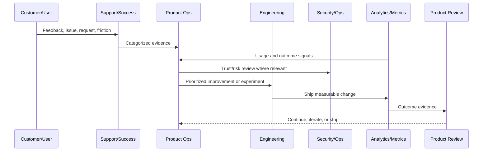

# Product Documentation and Evidence

> *"Defines product operations documentation, decision records, metric reports, feedback records, experiment records, launch notes, and evidence standards."*

---

# Purpose

Defines product operations documentation, decision records, metric reports, feedback records, experiment records, launch notes, and evidence standards.

---

# Product Operations Problem

Product memory disappears quickly when decisions are not documented.

---

# Product Operations Decision

## Decision

CLARA product operations should preserve decision evidence so future teams understand why priorities, experiments, and trade-offs were chosen.

## Status

Accepted.

---

# Product Operations Rule

Every CLARA product operations activity should connect:

```text
Customer Evidence -> Product Metric -> Risk/Trust Review -> Decision -> Owner -> Experiment/Improvement -> Validation -> Documentation
```

A product operations decision is not mature if it cannot answer:

```text
what customer problem it addresses
what evidence supports it
what metric should move
what trust/security/reliability risk exists
who owns the decision
how success will be measured
how failure will be detected
what documentation/evidence will be kept
```

---

# Recommended Product Operations Flow



---

# Production-Ready Checklist

- [ ] Customer evidence is captured.
- [ ] Product metric is defined.
- [ ] Security/trust impact is considered.
- [ ] Reliability/operations impact is considered.
- [ ] Owner is assigned.
- [ ] Success criteria are defined.
- [ ] Failure signal is defined.
- [ ] Documentation/evidence is stored.
- [ ] Follow-up cadence is scheduled.

---

# Acceptance Criteria

- [ ] Product operations decision-making is evidence-based.
- [ ] Feedback is not lost.
- [ ] Metrics are connected to customer outcomes.
- [ ] Risk and trust are included.
- [ ] Owners and cadence are clear.
- [ ] AI coding assistants can apply this safely.

---

# Anti-patterns

Avoid:

- Roadmap decisions based only on loudest customer.
- Vanity metrics without product outcome.
- Growth experiments without trust guardrails.
- Support tickets ignored by product.
- Security/reliability treated as engineering-only concerns.
- Feedback stored only in chat.
- Experiments with no hypothesis.
- Decisions with no owner.
- Metrics reviewed only after problems explode.

---

# Related Documents

- ../../BOOK-02-Product-and-Domain/
- ../../BOOK-05-Engineering-Execution-Plan/
- ../../BOOK-06-Security-Governance-and-Compliance/
- ../../BOOK-07-Operations-Observability-and-Reliability/
- ../../BOOK-08-Implementation-Delivery-and-Production-Launch/

---

# Navigation

**Previous:** `09-Product-Review-Cadence.md`

**Next:** `11-Product-Operations-Anti-Patterns.md`

---

# Documentation Types

Product operations should maintain:

```text
product decision records
experiment records
customer feedback summaries
metric review notes
roadmap decision logs
risk acceptance records
support knowledge updates
launch/post-launch notes
AI quality review notes
business review summaries
```

---

# Evidence Requirements

Evidence should include:

```text
source
timestamp
owner
customer segment if relevant
metric data if relevant
support ticket links where available
risk notes
decision outcome
follow-up date
```

---

# Product Decision Record Template

```markdown
# Product Decision Record

Decision:
Date:
Owner:
Evidence:
Metric impacted:
Customer segment:
Security/trust impact:
Alternatives considered:
Decision:
Follow-up:
```

---

# Evidence Rule

If a future team cannot understand why a product decision was made, the documentation failed.
