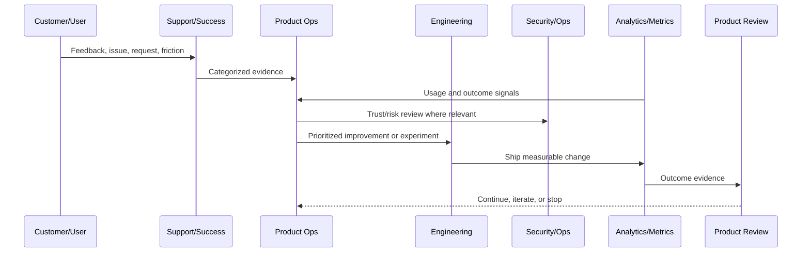

# Product Operations Anti-Patterns

> *"Defines common product operations anti-patterns that CLARA should avoid after launch."*

---

# Purpose

Defines common product operations anti-patterns that CLARA should avoid after launch.

---

# Product Operations Problem

Anti-patterns help teams recognize failure modes before they become culture.

---

# Product Operations Decision

## Decision

CLARA should actively avoid vanity metrics, roadmap chaos, unowned feedback, unsafe experiments, support blindness, and growth-at-all-costs behavior.

## Status

Accepted.

---

# Product Operations Rule

Every CLARA product operations activity should connect:

```text
Customer Evidence -> Product Metric -> Risk/Trust Review -> Decision -> Owner -> Experiment/Improvement -> Validation -> Documentation
```

A product operations decision is not mature if it cannot answer:

```text
what customer problem it addresses
what evidence supports it
what metric should move
what trust/security/reliability risk exists
who owns the decision
how success will be measured
how failure will be detected
what documentation/evidence will be kept
```

---

# Recommended Product Operations Flow



---

# Production-Ready Checklist

- [ ] Customer evidence is captured.
- [ ] Product metric is defined.
- [ ] Security/trust impact is considered.
- [ ] Reliability/operations impact is considered.
- [ ] Owner is assigned.
- [ ] Success criteria are defined.
- [ ] Failure signal is defined.
- [ ] Documentation/evidence is stored.
- [ ] Follow-up cadence is scheduled.

---

# Acceptance Criteria

- [ ] Product operations decision-making is evidence-based.
- [ ] Feedback is not lost.
- [ ] Metrics are connected to customer outcomes.
- [ ] Risk and trust are included.
- [ ] Owners and cadence are clear.
- [ ] AI coding assistants can apply this safely.

---

# Anti-patterns

Avoid:

- Roadmap decisions based only on loudest customer.
- Vanity metrics without product outcome.
- Growth experiments without trust guardrails.
- Support tickets ignored by product.
- Security/reliability treated as engineering-only concerns.
- Feedback stored only in chat.
- Experiments with no hypothesis.
- Decisions with no owner.
- Metrics reviewed only after problems explode.

---

# Related Documents

- ../../BOOK-02-Product-and-Domain/
- ../../BOOK-05-Engineering-Execution-Plan/
- ../../BOOK-06-Security-Governance-and-Compliance/
- ../../BOOK-07-Operations-Observability-and-Reliability/
- ../../BOOK-08-Implementation-Delivery-and-Production-Launch/

---

# Navigation

**Previous:** `10-Product-Documentation-and-Evidence.md`

**Next:** `12-Part-01-Summary.md`

---

# Anti-Patterns to Avoid

Avoid:

```text
roadmap by loudest voice
vanity metric obsession
growth at all costs
experiments with no hypothesis
shipping without success criteria
ignoring support feedback
treating security as blocker instead of product trust
not measuring AI quality
not reviewing churn reasons
permanent feature flags
no owner for feedback themes
decision memory living only in chat
```

---

# Warning Signs

Watch for:

```text
many features shipped but activation flat
support tickets increasing after each release
security risk accepted informally
AI quality complaints ignored
roadmap changing weekly without evidence
no one owns metrics
customer feedback has no status
experiments never reviewed
```

---

# Recovery Actions

If anti-patterns appear:

```text
pause new experiments
review customer evidence
redefine metric hierarchy
assign owners
document decisions
update roadmap criteria
create trust guardrails
run product operations review
```

---

# Anti-Pattern Rule

Product operations should make bad decision patterns visible before they become culture.
