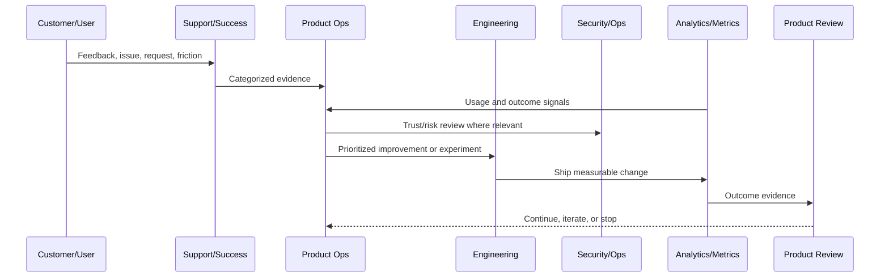

# Part 01 Summary

> *"Summarizes Product Operations Foundation and prepares for Book IX Part 02."*

---

# Purpose

Summarizes Product Operations Foundation and prepares for Book IX Part 02.

---

# Product Operations Problem

Customer onboarding and success comes next because product operations must translate foundation into customer activation and retention.

---

# Product Operations Decision

## Decision

CLARA should proceed to Customer Onboarding and Success after defining product operations overview, principles, lifecycle, metrics, feedback, experimentation, risk, roles, cadence, documentation, and anti-patterns.

## Status

Accepted.

---

# Product Operations Rule

Every CLARA product operations activity should connect:

```text
Customer Evidence -> Product Metric -> Risk/Trust Review -> Decision -> Owner -> Experiment/Improvement -> Validation -> Documentation
```

A product operations decision is not mature if it cannot answer:

```text
what customer problem it addresses
what evidence supports it
what metric should move
what trust/security/reliability risk exists
who owns the decision
how success will be measured
how failure will be detected
what documentation/evidence will be kept
```

---

# Recommended Product Operations Flow



---

# Production-Ready Checklist

- [ ] Customer evidence is captured.
- [ ] Product metric is defined.
- [ ] Security/trust impact is considered.
- [ ] Reliability/operations impact is considered.
- [ ] Owner is assigned.
- [ ] Success criteria are defined.
- [ ] Failure signal is defined.
- [ ] Documentation/evidence is stored.
- [ ] Follow-up cadence is scheduled.

---

# Acceptance Criteria

- [ ] Product operations decision-making is evidence-based.
- [ ] Feedback is not lost.
- [ ] Metrics are connected to customer outcomes.
- [ ] Risk and trust are included.
- [ ] Owners and cadence are clear.
- [ ] AI coding assistants can apply this safely.

---

# Anti-patterns

Avoid:

- Roadmap decisions based only on loudest customer.
- Vanity metrics without product outcome.
- Growth experiments without trust guardrails.
- Support tickets ignored by product.
- Security/reliability treated as engineering-only concerns.
- Feedback stored only in chat.
- Experiments with no hypothesis.
- Decisions with no owner.
- Metrics reviewed only after problems explode.

---

# Related Documents

- ../../BOOK-02-Product-and-Domain/
- ../../BOOK-05-Engineering-Execution-Plan/
- ../../BOOK-06-Security-Governance-and-Compliance/
- ../../BOOK-07-Operations-Observability-and-Reliability/
- ../../BOOK-08-Implementation-Delivery-and-Production-Launch/

---

# Navigation

**Previous:** `11-Product-Operations-Anti-Patterns.md`

**Next:** `../PART-02-Customer-Onboarding-and-Success/README.md`

---

# Part 01 Completion

Part 01 establishes:

- Product operations overview.
- Product operations principles.
- Customer lifecycle model.
- Product metrics operating model.
- Product feedback operating model.
- Product experimentation principles.
- Product risk and trust model.
- Product operations roles and RACI.
- Product review cadence.
- Product documentation and evidence.
- Product operations anti-patterns.

---

# Ready for Part 02

The next part should be:

```text
BOOK IX — PART 02: Customer Onboarding and Success
```

It should define:

- Customer onboarding overview.
- Account/workspace setup flow.
- First value moment.
- Activation checklist.
- Customer success playbooks.
- Trial-to-paid lifecycle.
- Customer health scoring.
- Onboarding support workflow.
- Product education and documentation.
- Onboarding metrics.
- Onboarding anti-patterns.
- Part 02 summary.
