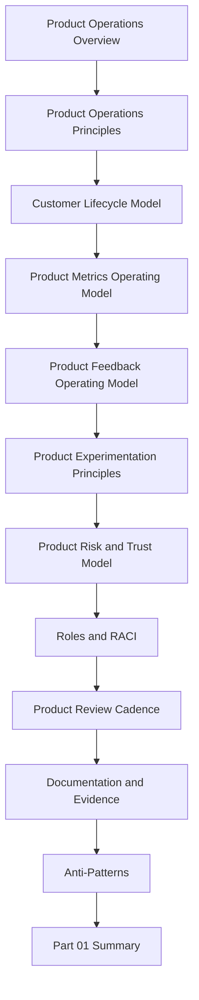

# PART-01 — Product Operations Foundation

> *"After launch, the product becomes a living system. Product operations is how CLARA learns, improves, grows, and protects customer trust."*

---

# Purpose

Part 01 defines the foundation of CLARA's product operations system.

It covers:

- Product Operations Overview.
- Product Operations Principles.
- Customer Lifecycle Model.
- Product Metrics Operating Model.
- Product Feedback Operating Model.
- Product Experimentation Principles.
- Product Risk and Trust Model.
- Product Operations Roles and RACI.
- Product Review Cadence.
- Product Documentation and Evidence.
- Product Operations Anti-Patterns.
- Part 01 Summary.

---

# Book IX Position

Book IX comes after:

```text
BOOK VIII — Implementation, Delivery & Production Launch
```

Book VIII explains how CLARA is implemented, launched, validated, hardened, and handed over.

Book IX explains how CLARA is operated as a product after launch:

```text
customer onboarding
customer success
support learning loop
growth experiments
billing and packaging operations
analytics and product insight
feedback prioritization
continuous security
continuous reliability
AI quality improvement
business review cadence
continuous improvement
```

---

# Book IX Proposed Structure

```text
PART-01 Product Operations Foundation
PART-02 Customer Onboarding and Success
PART-03 Support Operations and Knowledge Loop
PART-04 Growth Experiments and Activation
PART-05 Billing Packaging and Monetization Operations
PART-06 Analytics and Product Insights
PART-07 Feedback Prioritization and Roadmap Operations
PART-08 Continuous Security and Compliance Operations
PART-09 Continuous Reliability and Performance Improvement
PART-10 AI Quality and Automation Improvement
PART-11 Business Review and Operating Cadence
PART-12 Product Operations Handover and Master Index
```

---

# Chapter Map

| Chapter | Title |
|---:|---|
| 01 | Product Operations Overview |
| 02 | Product Operations Principles |
| 03 | Customer Lifecycle Model |
| 04 | Product Metrics Operating Model |
| 05 | Product Feedback Operating Model |
| 06 | Product Experimentation Principles |
| 07 | Product Risk and Trust Model |
| 08 | Product Operations Roles and RACI |
| 09 | Product Review Cadence |
| 10 | Product Documentation and Evidence |
| 11 | Product Operations Anti-Patterns |
| 12 | Part 01 Summary |

---

# Product Operations Foundation Map



---

# Product Operations Non-Negotiables

CLARA product operations must enforce:

```text
customer evidence over opinion
trust and security over short-term growth
measurable product outcomes
clear owner for every product decision
feedback captured from all channels
experiments with hypothesis and guardrails
support feedback loop
incident and reliability signals included in product decisions
AI quality monitored after launch
roadmap prioritization based on impact and risk
documentation of decisions and evidence
review cadence
```

---

# Relationship to Previous Books

Book IX depends on:

```text
Book II  -> product/domain model
Book V   -> execution/backlog model
Book VI  -> security/governance/compliance
Book VII -> operations/reliability
Book VIII -> implementation/launch/handover
```

---

# Navigation

**Previous:** `../BOOK-08-Implementation-Delivery-and-Production-Launch/BOOK-08-Master-Index/README.md`

**Next:** `01-Product-Operations-Overview.md`
