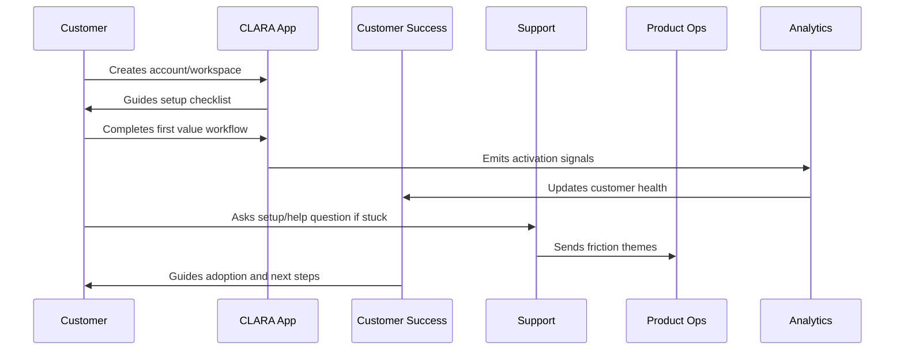

# Customer Onboarding and Success Overview

> *"Introduces CLARA's onboarding and customer success model for helping new customers reach value quickly, safely, and measurably."*

---

# Purpose

Introduces CLARA's onboarding and customer success model for helping new customers reach value quickly, safely, and measurably.

---

# Onboarding Problem

A customer who signs up but never reaches value is not truly onboarded.

---

# Onboarding Decision

## Decision

CLARA should treat onboarding as a managed customer lifecycle stage with setup guidance, activation milestones, support readiness, success ownership, and measurable outcomes.

## Status

Accepted.

---

# Customer Success Rule

Every CLARA onboarding workflow should connect:

```text
Customer Goal -> Setup Step -> First Value Signal -> Success Owner -> Support Path -> Metric -> Feedback Loop
```

An onboarding process is not mature if it cannot answer:

```text
what the customer is trying to achieve
what setup is required
what secure default is applied
what first value moment proves progress
who owns customer follow-up
how support handles friction
what metric detects success or risk
what feedback goes back to product
```

---

# Recommended Onboarding Flow



---

# Production-Ready Checklist

- [ ] Setup flow is clear.
- [ ] Secure defaults are applied.
- [ ] Roles and permissions are understandable.
- [ ] First value moment is defined.
- [ ] Activation checklist exists.
- [ ] Customer success playbook exists.
- [ ] Support workflow exists.
- [ ] Onboarding metrics are tracked.
- [ ] Feedback loop to product exists.
- [ ] Documentation is maintained.

---

# Acceptance Criteria

- [ ] Customer can complete setup without hidden tribal knowledge.
- [ ] Customer reaches first value.
- [ ] Support can troubleshoot onboarding issues.
- [ ] Success team can identify stuck customers.
- [ ] Product team can see onboarding friction.
- [ ] Security and privacy are preserved.
- [ ] AI coding assistants can apply this safely.

---

# Anti-patterns

Avoid:

- Treating signup as activation.
- Asking customers to configure everything before seeing value.
- Insecure default permissions.
- Confusing role names.
- No workspace owner concept.
- No onboarding checklist.
- No support escalation path.
- No onboarding metrics.
- No feedback loop from onboarding issues.
- Generic success follow-up with no customer context.

---

# Related Documents

- ../PART-01-Product-Operations-Foundation/README.md
- ../../BOOK-02-Product-and-Domain/
- ../../BOOK-06-Security-Governance-and-Compliance/
- ../../BOOK-07-Operations-Observability-and-Reliability/
- ../../BOOK-08-Implementation-Delivery-and-Production-Launch/

---

# Navigation

**Previous:** `../PART-01-Product-Operations-Foundation/12-Part-01-Summary.md`

**Next:** `14-Account-and-Workspace-Setup-Flow.md`

---

# Onboarding Scope

CLARA onboarding covers:

```text
account creation
organization/workspace creation
team invite
role setup
channel/integration setup
first customer conversation/ticket
AI draft review where enabled
knowledge base setup
support readiness
success follow-up
trial-to-paid conversion
```

---

# Onboarding Outcome

A customer is considered onboarded when:

```text
workspace is configured
at least one team member can operate the workflow
at least one value-producing workflow is completed
customer understands next steps
support/success knows customer state
activation metrics are captured
```

---

# Guiding Question

```text
Did the customer reach value, or did they merely finish registration?
```
