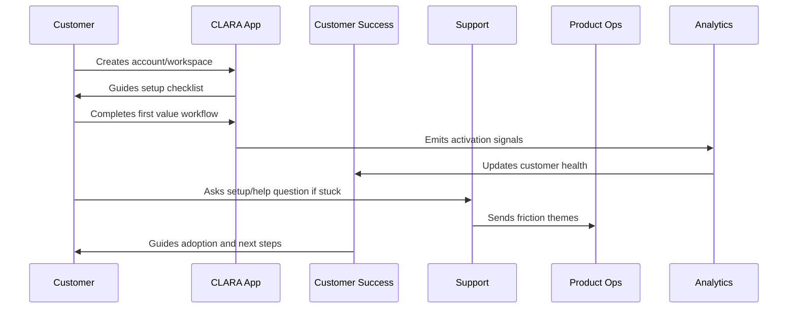
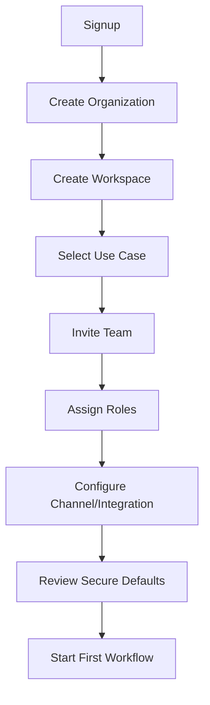

# Account and Workspace Setup Flow

> *"Defines the customer account, organization, workspace, team invite, role setup, security configuration, and initial product configuration flow."*

---

# Purpose

Defines the customer account, organization, workspace, team invite, role setup, security configuration, and initial product configuration flow.

---

# Onboarding Problem

Setup friction and unclear permissions can block adoption and create security mistakes early.

---

# Onboarding Decision

## Decision

CLARA onboarding should guide customers through account/workspace setup with secure defaults, clear role assignment, and minimal friction.

## Status

Accepted.

---

# Customer Success Rule

Every CLARA onboarding workflow should connect:

```text
Customer Goal -> Setup Step -> First Value Signal -> Success Owner -> Support Path -> Metric -> Feedback Loop
```

An onboarding process is not mature if it cannot answer:

```text
what the customer is trying to achieve
what setup is required
what secure default is applied
what first value moment proves progress
who owns customer follow-up
how support handles friction
what metric detects success or risk
what feedback goes back to product
```

---

# Recommended Onboarding Flow



---

# Production-Ready Checklist

- [ ] Setup flow is clear.
- [ ] Secure defaults are applied.
- [ ] Roles and permissions are understandable.
- [ ] First value moment is defined.
- [ ] Activation checklist exists.
- [ ] Customer success playbook exists.
- [ ] Support workflow exists.
- [ ] Onboarding metrics are tracked.
- [ ] Feedback loop to product exists.
- [ ] Documentation is maintained.

---

# Acceptance Criteria

- [ ] Customer can complete setup without hidden tribal knowledge.
- [ ] Customer reaches first value.
- [ ] Support can troubleshoot onboarding issues.
- [ ] Success team can identify stuck customers.
- [ ] Product team can see onboarding friction.
- [ ] Security and privacy are preserved.
- [ ] AI coding assistants can apply this safely.

---

# Anti-patterns

Avoid:

- Treating signup as activation.
- Asking customers to configure everything before seeing value.
- Insecure default permissions.
- Confusing role names.
- No workspace owner concept.
- No onboarding checklist.
- No support escalation path.
- No onboarding metrics.
- No feedback loop from onboarding issues.
- Generic success follow-up with no customer context.

---

# Related Documents

- ../PART-01-Product-Operations-Foundation/README.md
- ../../BOOK-02-Product-and-Domain/
- ../../BOOK-06-Security-Governance-and-Compliance/
- ../../BOOK-07-Operations-Observability-and-Reliability/
- ../../BOOK-08-Implementation-Delivery-and-Production-Launch/

---

# Navigation

**Previous:** `13-Customer-Onboarding-and-Success-Overview.md`

**Next:** `15-First-Value-Moment.md`

---

# Setup Flow

Recommended setup flow:

```text
1 create account
2 create organization/workspace
3 select business use case
4 invite team members
5 assign roles
6 configure primary channel/integration
7 configure notification/support preferences
8 review security defaults
9 complete first guided workflow
```

---

# Secure Defaults

Use secure defaults:

```text
least-privilege default roles
verified email before sensitive actions
workspace owner assignment
audit event for team invite/role change
restricted integration credential access
production-safe privacy settings
```

---

# Workspace Setup Map



---

# Setup Rule

Do not ask users to make high-risk security decisions before they understand the product.
