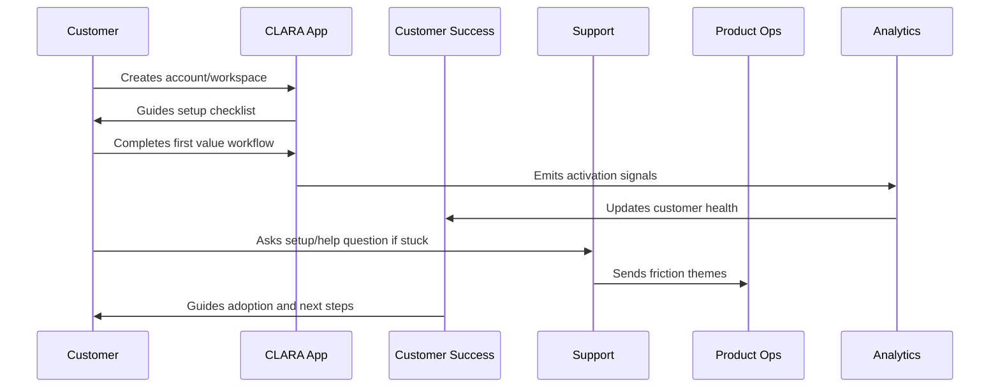
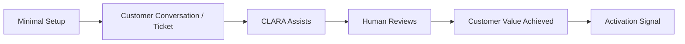

# First Value Moment

> *"Defines CLARA's first value moment and the shortest safe path from signup to meaningful product outcome."*

---

# Purpose

Defines CLARA's first value moment and the shortest safe path from signup to meaningful product outcome.

---

# Onboarding Problem

If customers do not experience value early, they churn before deeper features matter.

---

# Onboarding Decision

## Decision

CLARA should identify and optimize the first value moment so customers quickly experience the core value of the product.

## Status

Accepted.

---

# Customer Success Rule

Every CLARA onboarding workflow should connect:

```text
Customer Goal -> Setup Step -> First Value Signal -> Success Owner -> Support Path -> Metric -> Feedback Loop
```

An onboarding process is not mature if it cannot answer:

```text
what the customer is trying to achieve
what setup is required
what secure default is applied
what first value moment proves progress
who owns customer follow-up
how support handles friction
what metric detects success or risk
what feedback goes back to product
```

---

# Recommended Onboarding Flow



---

# Production-Ready Checklist

- [ ] Setup flow is clear.
- [ ] Secure defaults are applied.
- [ ] Roles and permissions are understandable.
- [ ] First value moment is defined.
- [ ] Activation checklist exists.
- [ ] Customer success playbook exists.
- [ ] Support workflow exists.
- [ ] Onboarding metrics are tracked.
- [ ] Feedback loop to product exists.
- [ ] Documentation is maintained.

---

# Acceptance Criteria

- [ ] Customer can complete setup without hidden tribal knowledge.
- [ ] Customer reaches first value.
- [ ] Support can troubleshoot onboarding issues.
- [ ] Success team can identify stuck customers.
- [ ] Product team can see onboarding friction.
- [ ] Security and privacy are preserved.
- [ ] AI coding assistants can apply this safely.

---

# Anti-patterns

Avoid:

- Treating signup as activation.
- Asking customers to configure everything before seeing value.
- Insecure default permissions.
- Confusing role names.
- No workspace owner concept.
- No onboarding checklist.
- No support escalation path.
- No onboarding metrics.
- No feedback loop from onboarding issues.
- Generic success follow-up with no customer context.

---

# Related Documents

- ../PART-01-Product-Operations-Foundation/README.md
- ../../BOOK-02-Product-and-Domain/
- ../../BOOK-06-Security-Governance-and-Compliance/
- ../../BOOK-07-Operations-Observability-and-Reliability/
- ../../BOOK-08-Implementation-Delivery-and-Production-Launch/

---

# Navigation

**Previous:** `14-Account-and-Workspace-Setup-Flow.md`

**Next:** `16-Activation-Checklist.md`

---

# First Value Definition

For CLARA, first value should be one of:

```text
first customer conversation imported
first support reply drafted
first ticket created and routed
first AI-assisted reply reviewed
first knowledge suggestion used
first integration event processed successfully
```

---

# First Value Requirements

The first value path should be:

```text
short
guided
safe
measurable
reversible where possible
low configuration burden
connected to core product promise
```

---

# First Value Map



---

# First Value Rule

Optimize onboarding around first meaningful outcome, not around completing every possible configuration.
