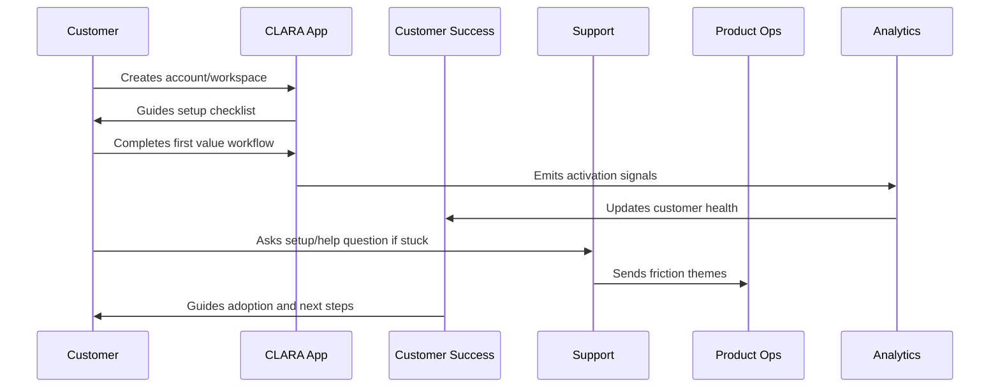

# Activation Checklist

> *"Defines the activation checklist for workspace setup, channel/integration setup, team invite, first conversation/ticket, AI draft review, and support readiness."*

---

# Purpose

Defines the activation checklist for workspace setup, channel/integration setup, team invite, first conversation/ticket, AI draft review, and support readiness.

---

# Onboarding Problem

Customers often get stuck when onboarding progress is implicit and not guided.

---

# Onboarding Decision

## Decision

CLARA should use an activation checklist to make progress visible and help customers complete key setup milestones.

## Status

Accepted.

---

# Customer Success Rule

Every CLARA onboarding workflow should connect:

```text
Customer Goal -> Setup Step -> First Value Signal -> Success Owner -> Support Path -> Metric -> Feedback Loop
```

An onboarding process is not mature if it cannot answer:

```text
what the customer is trying to achieve
what setup is required
what secure default is applied
what first value moment proves progress
who owns customer follow-up
how support handles friction
what metric detects success or risk
what feedback goes back to product
```

---

# Recommended Onboarding Flow



---

# Production-Ready Checklist

- [ ] Setup flow is clear.
- [ ] Secure defaults are applied.
- [ ] Roles and permissions are understandable.
- [ ] First value moment is defined.
- [ ] Activation checklist exists.
- [ ] Customer success playbook exists.
- [ ] Support workflow exists.
- [ ] Onboarding metrics are tracked.
- [ ] Feedback loop to product exists.
- [ ] Documentation is maintained.

---

# Acceptance Criteria

- [ ] Customer can complete setup without hidden tribal knowledge.
- [ ] Customer reaches first value.
- [ ] Support can troubleshoot onboarding issues.
- [ ] Success team can identify stuck customers.
- [ ] Product team can see onboarding friction.
- [ ] Security and privacy are preserved.
- [ ] AI coding assistants can apply this safely.

---

# Anti-patterns

Avoid:

- Treating signup as activation.
- Asking customers to configure everything before seeing value.
- Insecure default permissions.
- Confusing role names.
- No workspace owner concept.
- No onboarding checklist.
- No support escalation path.
- No onboarding metrics.
- No feedback loop from onboarding issues.
- Generic success follow-up with no customer context.

---

# Related Documents

- ../PART-01-Product-Operations-Foundation/README.md
- ../../BOOK-02-Product-and-Domain/
- ../../BOOK-06-Security-Governance-and-Compliance/
- ../../BOOK-07-Operations-Observability-and-Reliability/
- ../../BOOK-08-Implementation-Delivery-and-Production-Launch/

---

# Navigation

**Previous:** `15-First-Value-Moment.md`

**Next:** `17-Customer-Success-Playbooks.md`

---

# Activation Checklist Example

```text
workspace created
workspace owner assigned
email verified
team member invited
primary role assigned
first channel/integration connected
first conversation/ticket created
first reply sent or drafted
AI review flow completed if enabled
support documentation opened
```

---

# Checklist Behavior

Checklist should:

```text
show progress
explain why each step matters
link to setup screens
avoid blocking first value unnecessarily
highlight security-critical steps
allow optional advanced setup later
```

---

# Activation States

Use:

```text
not_started
in_progress
blocked
activated
expanded
at_risk
```

---

# Activation Rule

Activation must be based on customer value signals, not only account setup completion.
