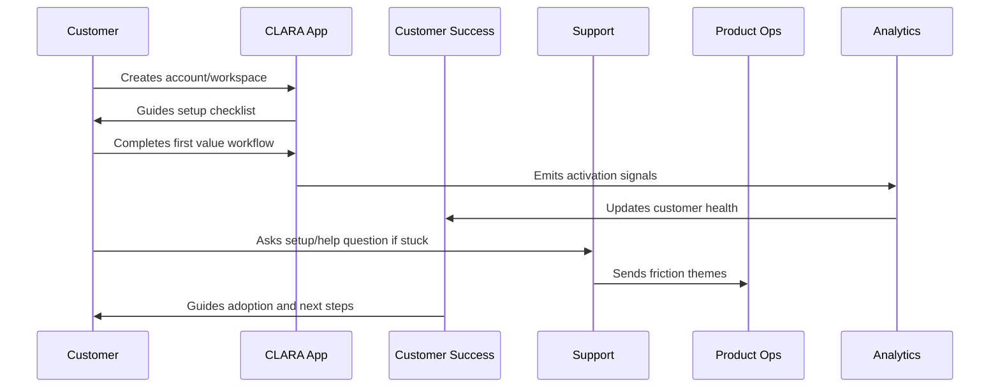

# Customer Success Playbooks

> *"Defines customer success playbooks for onboarding assistance, adoption coaching, risk detection, escalation, and expansion readiness."*

---

# Purpose

Defines customer success playbooks for onboarding assistance, adoption coaching, risk detection, escalation, and expansion readiness.

---

# Onboarding Problem

Without playbooks, customer success quality depends too much on individual memory and experience.

---

# Onboarding Decision

## Decision

CLARA customer success should use repeatable playbooks to support customers through onboarding, adoption, and value realization.

## Status

Accepted.

---

# Customer Success Rule

Every CLARA onboarding workflow should connect:

```text
Customer Goal -> Setup Step -> First Value Signal -> Success Owner -> Support Path -> Metric -> Feedback Loop
```

An onboarding process is not mature if it cannot answer:

```text
what the customer is trying to achieve
what setup is required
what secure default is applied
what first value moment proves progress
who owns customer follow-up
how support handles friction
what metric detects success or risk
what feedback goes back to product
```

---

# Recommended Onboarding Flow



---

# Production-Ready Checklist

- [ ] Setup flow is clear.
- [ ] Secure defaults are applied.
- [ ] Roles and permissions are understandable.
- [ ] First value moment is defined.
- [ ] Activation checklist exists.
- [ ] Customer success playbook exists.
- [ ] Support workflow exists.
- [ ] Onboarding metrics are tracked.
- [ ] Feedback loop to product exists.
- [ ] Documentation is maintained.

---

# Acceptance Criteria

- [ ] Customer can complete setup without hidden tribal knowledge.
- [ ] Customer reaches first value.
- [ ] Support can troubleshoot onboarding issues.
- [ ] Success team can identify stuck customers.
- [ ] Product team can see onboarding friction.
- [ ] Security and privacy are preserved.
- [ ] AI coding assistants can apply this safely.

---

# Anti-patterns

Avoid:

- Treating signup as activation.
- Asking customers to configure everything before seeing value.
- Insecure default permissions.
- Confusing role names.
- No workspace owner concept.
- No onboarding checklist.
- No support escalation path.
- No onboarding metrics.
- No feedback loop from onboarding issues.
- Generic success follow-up with no customer context.

---

# Related Documents

- ../PART-01-Product-Operations-Foundation/README.md
- ../../BOOK-02-Product-and-Domain/
- ../../BOOK-06-Security-Governance-and-Compliance/
- ../../BOOK-07-Operations-Observability-and-Reliability/
- ../../BOOK-08-Implementation-Delivery-and-Production-Launch/

---

# Navigation

**Previous:** `16-Activation-Checklist.md`

**Next:** `18-Trial-to-Paid-Lifecycle.md`

---

# Customer Success Playbooks

Recommended playbooks:

```text
new trial welcome
workspace setup assistance
integration setup assistance
first value coaching
stuck activation follow-up
low usage recovery
high-value customer check-in
trial conversion review
expansion readiness review
security-sensitive customer onboarding
```

---

# Playbook Template

```markdown
# Customer Success Playbook

Name:
Trigger:
Customer segment:
Goal:
Required context:
Steps:
Success signal:
Escalation path:
Metric impacted:
Follow-up:
```

---

# Success Follow-Up Triggers

Trigger follow-up when:

```text
activation incomplete after threshold
integration setup failed
invited team not active
AI feature rejected repeatedly
support ticket opened during onboarding
trial close date approaching
usage drops after first value
```

---

# Playbook Rule

Customer success should act from evidence, not guesswork.
