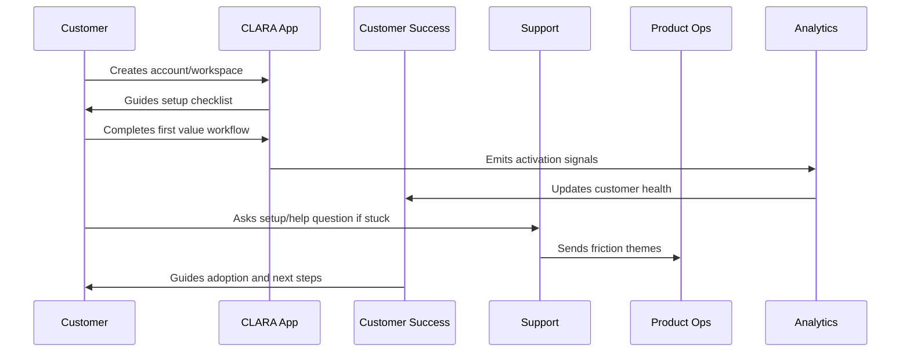

# Trial-to-Paid Lifecycle

> *"Defines trial, evaluation, conversion, upgrade, payment readiness, value proof, and handoff into paid customer lifecycle."*

---

# Purpose

Defines trial, evaluation, conversion, upgrade, payment readiness, value proof, and handoff into paid customer lifecycle.

---

# Onboarding Problem

A trial can generate signups without producing paid customers if value and conversion steps are unclear.

---

# Onboarding Decision

## Decision

CLARA trial-to-paid flow should connect activation evidence, customer intent, product value, pricing clarity, and success follow-up.

## Status

Accepted.

---

# Customer Success Rule

Every CLARA onboarding workflow should connect:

```text
Customer Goal -> Setup Step -> First Value Signal -> Success Owner -> Support Path -> Metric -> Feedback Loop
```

An onboarding process is not mature if it cannot answer:

```text
what the customer is trying to achieve
what setup is required
what secure default is applied
what first value moment proves progress
who owns customer follow-up
how support handles friction
what metric detects success or risk
what feedback goes back to product
```

---

# Recommended Onboarding Flow



---

# Production-Ready Checklist

- [ ] Setup flow is clear.
- [ ] Secure defaults are applied.
- [ ] Roles and permissions are understandable.
- [ ] First value moment is defined.
- [ ] Activation checklist exists.
- [ ] Customer success playbook exists.
- [ ] Support workflow exists.
- [ ] Onboarding metrics are tracked.
- [ ] Feedback loop to product exists.
- [ ] Documentation is maintained.

---

# Acceptance Criteria

- [ ] Customer can complete setup without hidden tribal knowledge.
- [ ] Customer reaches first value.
- [ ] Support can troubleshoot onboarding issues.
- [ ] Success team can identify stuck customers.
- [ ] Product team can see onboarding friction.
- [ ] Security and privacy are preserved.
- [ ] AI coding assistants can apply this safely.

---

# Anti-patterns

Avoid:

- Treating signup as activation.
- Asking customers to configure everything before seeing value.
- Insecure default permissions.
- Confusing role names.
- No workspace owner concept.
- No onboarding checklist.
- No support escalation path.
- No onboarding metrics.
- No feedback loop from onboarding issues.
- Generic success follow-up with no customer context.

---

# Related Documents

- ../PART-01-Product-Operations-Foundation/README.md
- ../../BOOK-02-Product-and-Domain/
- ../../BOOK-06-Security-Governance-and-Compliance/
- ../../BOOK-07-Operations-Observability-and-Reliability/
- ../../BOOK-08-Implementation-Delivery-and-Production-Launch/

---

# Navigation

**Previous:** `17-Customer-Success-Playbooks.md`

**Next:** `19-Customer-Health-Scoring.md`

---

# Trial-to-Paid Stages

```text
trial signup
setup started
first value reached
active evaluation
value proof
pricing/package review
decision support
payment/admin setup
conversion
post-conversion onboarding
```

---

# Conversion Signals

Track:

```text
activation completed
repeat usage
team invite completed
integration connected
support issue resolved
customer asks pricing/package question
admin/billing page viewed
positive success check-in
```

---

# Trial Risk Signals

Watch:

```text
no setup activity
integration failure unresolved
no first value
high support friction
AI quality complaint
unclear pricing
decision maker not engaged
usage drops before trial end
```

---

# Trial Rule

Do not push conversion before customer value is visible.
