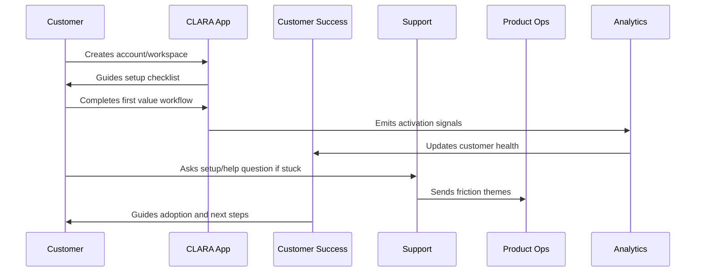
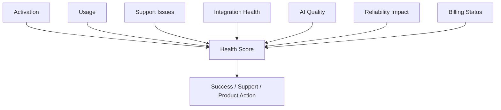

# Customer Health Scoring

> *"Defines customer health scoring across activation, usage, support issues, reliability impact, AI quality, integration health, billing status, and engagement."*

---

# Purpose

Defines customer health scoring across activation, usage, support issues, reliability impact, AI quality, integration health, billing status, and engagement.

---

# Onboarding Problem

Teams miss churn risk when customer health is based only on intuition.

---

# Onboarding Decision

## Decision

CLARA should use customer health scoring to identify customers who are healthy, at risk, stuck, or ready for expansion.

## Status

Accepted.

---

# Customer Success Rule

Every CLARA onboarding workflow should connect:

```text
Customer Goal -> Setup Step -> First Value Signal -> Success Owner -> Support Path -> Metric -> Feedback Loop
```

An onboarding process is not mature if it cannot answer:

```text
what the customer is trying to achieve
what setup is required
what secure default is applied
what first value moment proves progress
who owns customer follow-up
how support handles friction
what metric detects success or risk
what feedback goes back to product
```

---

# Recommended Onboarding Flow



---

# Production-Ready Checklist

- [ ] Setup flow is clear.
- [ ] Secure defaults are applied.
- [ ] Roles and permissions are understandable.
- [ ] First value moment is defined.
- [ ] Activation checklist exists.
- [ ] Customer success playbook exists.
- [ ] Support workflow exists.
- [ ] Onboarding metrics are tracked.
- [ ] Feedback loop to product exists.
- [ ] Documentation is maintained.

---

# Acceptance Criteria

- [ ] Customer can complete setup without hidden tribal knowledge.
- [ ] Customer reaches first value.
- [ ] Support can troubleshoot onboarding issues.
- [ ] Success team can identify stuck customers.
- [ ] Product team can see onboarding friction.
- [ ] Security and privacy are preserved.
- [ ] AI coding assistants can apply this safely.

---

# Anti-patterns

Avoid:

- Treating signup as activation.
- Asking customers to configure everything before seeing value.
- Insecure default permissions.
- Confusing role names.
- No workspace owner concept.
- No onboarding checklist.
- No support escalation path.
- No onboarding metrics.
- No feedback loop from onboarding issues.
- Generic success follow-up with no customer context.

---

# Related Documents

- ../PART-01-Product-Operations-Foundation/README.md
- ../../BOOK-02-Product-and-Domain/
- ../../BOOK-06-Security-Governance-and-Compliance/
- ../../BOOK-07-Operations-Observability-and-Reliability/
- ../../BOOK-08-Implementation-Delivery-and-Production-Launch/

---

# Navigation

**Previous:** `18-Trial-to-Paid-Lifecycle.md`

**Next:** `20-Onboarding-Support-Workflow.md`

---

# Health Score Dimensions

Customer health should include:

```text
activation progress
usage frequency
critical workflow completion
team adoption
integration health
support ticket severity
AI quality satisfaction
reliability impact
billing/payment status
feedback sentiment
```

---

# Health States

Use:

```text
healthy
watch
at_risk
critical
expansion_ready
unknown
```

---

# Health Score Map



---

# Health Rule

A health score should trigger action, not just decorate dashboards.
